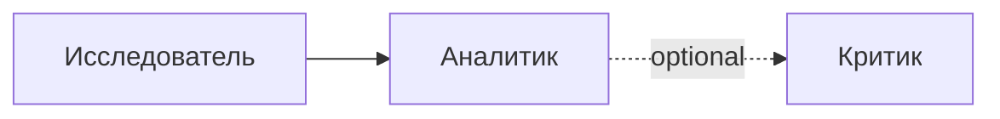
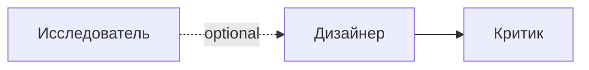
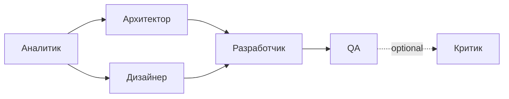
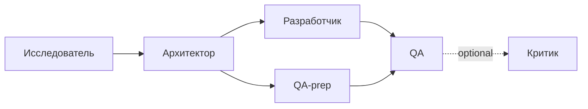
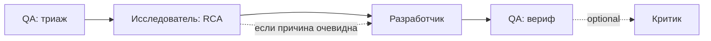
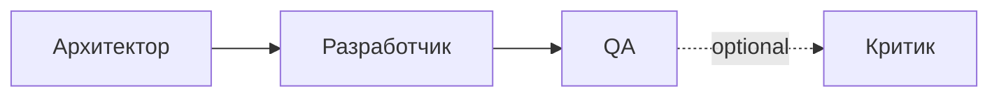
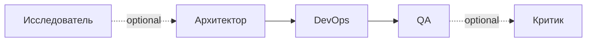
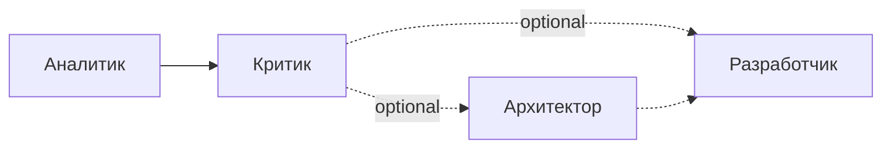
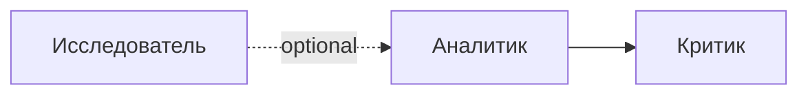
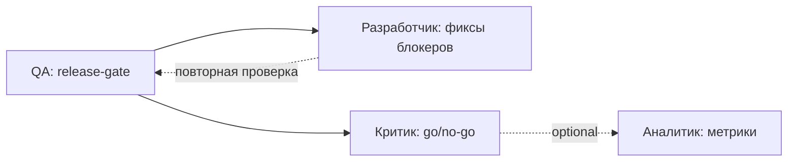

# TaskFlow — библиотека утверждённых шаблонов совместной работы

**Версия:** 1.0  
**Назначение:** не позволять оркестратору собирать «самодеятельные» графы под каждую задачу, а запускать только проверенные, предсказуемые шаблоны. На каждую новую задачу система семантически подбирает 2–3 подходящих шаблона, объясняет выбор владельцу и запускает роли только после явного утверждения.

## Принципы

1. **Оркестратор — не исполнитель.** В графе он только предлагает шаблон / новую версию плана; узлов у него нет.
2. **Артефакт — это передаваемый результат**, а не «роль закончила работу». Артефакты конкретны: бриф, список источников, требования, UX-спека, ADR, контракт API, план тестирования, отчёт о регрессии.
3. **Контекст передаётся узко.** Следующая роль получает нужный ей артефакт (или набор артефактов), а не полный чат.
4. **Три типа gate'ов на ребре:**  
   - `submitted` — узел закончил работу и сдал артефакт;  
   - `artifact_ready` — артефакт записан и прошёл собственные проверки узла;  
   - `accepted` — владелец явно одобрил артефакт (например, ADR перед кодом, план релиза перед выкаткой).
5. **Открытые вопросы — часть контракта.** Каждый узел фиксирует, что он не решил и передаёт дальше.
6. **Версионируемость.** Каждый шаблон имеет `version`; изменения идут через новую версию, владелец диф-ревью.
7. **Минимальная версия обязательна.** Для каждого шаблона указано, что можно убрать без потери смысла.
8. **Никаких ролей «на всякий случай».** QA, Критик, Архитектор, Дизайнер появляются, только если их работа реально нужна.

## Роли

Всего 7 ролей; оркестратор не входит в этот список.

| Роль | Назначение |
|------|------------|
| Исследователь | Сбор и проверка фактов, источников, ограничений |
| Аналитик | Структурирование требований, брифов, метрик |
| Архитектор | Технические решения: компоненты, контракты, риски |
| Дизайнер интерфейсов | UX-концепты, сценарии, макеты |
| Разработчик | Реализация, рефакторинг, фиксы |
| QA | Триаж, проверка по AC, регрессия |
| Критик-проверяющий | Независимое ревью, гейт-решения, аудит |

## Каталог шаблонов (сводная таблица)

| # | Шаблон | Когда брать (теги) | Главные роли | Параллели | Минимальная версия |
|---|--------|---------------------|--------------|-----------|---------------------|
| 1 | Research Brief | `research`, `discovery`, `spike`, `recon` | Исследователь → Аналитик → (опц.) Критик | нет | без Критика |
| 2 | UX Concept | `ux`, `ui`, `wireframe`, `prototype`, `flow` | Дизайнер интерфейсов → (опц.) Критик; опц. Исследователь до | нет | Дизайнер |
| 3 | Product Feature | `feature`, `story`, `epic`, `capability` | Аналитик → [Архитектор ‖ Дизайнер] → Разработчик → QA → (опц.) Критик | **Архитектор ‖ Дизайнер** | backend: без Дизайнера; UI-локальная: без Архитектора |
| 4 | API Integration | `integration`, `api`, `webhook`, `oauth`, `vendor` | Исследователь → Архитектор → [Разработчик ‖ QA-prep] → QA → (опц.) Критик | **QA готовит contract-тесты параллельно с Разработчиком** | без Исследователя и без Критика |
| 5 | Bug Triage & Fix | `bug`, `defect`, `regression`, `incident`, `crash` | QA(триаж) → Исследователь(RCA) → Разработчик → QA(вериф); (опц.) Критик | при очевидной причине: Исследователь ‖ Разработчик | QA(триаж) → Разработчик → QA(вериф) |
| 6 | Tech Debt Reduction | `refactor`, `tech-debt`, `cleanup`, `dedup`, `modularization` | Архитектор → Разработчик → QA → (опц.) Критик | нет | Разработчик → QA |
| 7 | Infra Change | `infra`, `devops`, `deploy`, `tls`, `dns`, `secrets`, `k8s` | (опц.) Исследователь → Архитектор → DevOps(Разработчик) → QA → (опц.) Критик | нет | Архитектор → DevOps → QA |
| 8 | Audit | `audit`, `compliance`, `security-review`, `gap-analysis` | Аналитик → Критик → (опц.) [Архитектор ‖ Разработчик] | после Критика опц. Архитектор и Разработчик стартуют параллельно | Критик (если scope и критерии даны владельцем) |
| 9 | Doc Pass | `docs`, `documentation`, `readme`, `runbook`, `manual` | (опц.) Исследователь → Аналитик → (опц.) Критик | нет | Аналитик |
| 10 | Release Train | `release`, `ship`, `deploy-prod`, `tag`, `changelog` | QA(release-gate) → (опц.) Разработчик(фиксы блокеров) → Критик(go/no-go) → (опц.) Аналитик(метрики) | нет | QA → Критик |

---

# Шаблон 1: Research Brief

## 1. Назначение
Превратить размытую тему в структурированную карту «что известно / что противоречит / что непонятно / что делать дальше» — чтобы владелец мог за ≤10 минут принять решение.

## 2. Когда выбирать
**Признаки в тексте задачи:** «разобраться», «изучить», «что такое», «стоит ли», «оценить», «сравнить подходы», «как работает», «best practices», «посмотреть, какие варианты».  
**Теги:** `research`, `discovery`, `recon`, `spike`.  
**Риски/ограничения:** риск «бесконечного сбора» — нужен явный стоп-критерий (N источников / конкретный вопрос).  
**Не выбирать, когда:**
- уже есть конкретное требование с AC (это `Product Feature`);
- есть баг с шагами воспроизведения (это `Bug Triage & Fix`);
- владелец сам уже знает ответ и просто хочет его зафиксировать.

## 3. Граф ролей
- Участники: Исследователь → Аналитик → (опц.) Критик.
- Параллельных ветвей нет.
- Зависимости: Аналитик ждёт Исследователя; Критик ждёт Аналитика.
- Необязательные: Критик.

## 4. Узлы графа

| # | Роль | Работа | Входной контекст | Артефакт на выходе | Формат | Проверка | Открытые вопросы → следующей роли |
|---|------|--------|------------------|--------------------|--------|----------|------------------------------------|
| 1 | Исследователь | Собрать источники, выделить 3–7 ключевых тезисов, зафиксировать противоречия и неизвестное | Исходный вопрос владельца + теги | `research-notes.md` | markdown: *Источники / Тезисы / Противоречия / Неизвестное* | ≥3 независимых источника на главный тезис; каждый тезис ≤2 предложения; неизвестное зафиксировано явно | «Какие из тезисов критичны для решения?», «Где пробелы, по которым нужна ещё одна итерация?» |
| 2 | Аналитик | Структурировать тезисы в карту «факт / гипотеза / риск / рекомендация», сформулировать варианты действий | `research-notes.md` + исходный вопрос владельца | `brief.md` | markdown, ≤2 страницы: *Executive summary / Факты / Гипотезы / Риски / Рекомендация / Критерии решения* | Рекомендация имеет явные «если …, то …» критерии; риск-секция не пуста; ≤2 страницы | «Какая часть рекомендации вызывает сомнения?», «Какие допущения не проверены?» |
| 3 | Критик-проверяющий (опц.) | Проверить `brief.md` против источников, найти дыры в логике | `brief.md` + `research-notes.md` | `brief-review.md` | markdown: список замечаний со ссылками на источники или пункты `brief.md` + статус (`ok` / `требует правок`) | Каждое замечание имеет ссылку на источник или конкретный пункт `brief.md` | «Какие пункты брифа требуют пересмотра?» |

## 5. Рёбра графа

| От | К | Артефакт | Gate | Зачем зависимость |
|----|---|----------|------|--------------------|
| Исследователь | Аналитик | `research-notes.md` | `submitted` | Без фактической базы синтез превратится в догадки |
| Аналитик | Критик | `brief.md` | `artifact_ready` | Критик должен видеть финальную версию брифа, а не черновик |

## 6. Mermaid DAG


## 7. Пример задачи
«Изучить варианты локального LLM-инференса для суммаризации писем — стоит ли тащить vLLM, или хватит llama.cpp с GGUF, на какой машине это должно крутиться?»

## 8. Критерии успеха всего шаблона
- Владелец за ≤10 минут читает `brief.md` и принимает решение: делать / не делать / нужна ещё итерация.
- Каждое ключевое утверждение в `brief.md` подтверждено источником из `research-notes.md`.
- Решение владельца задокументировано (комментарий в задаче / отдельный `decision.md`).

## 9. Минимальная версия
- Убрать Критика.
- Если Исследователь и Аналитик — один человек — можно схлопнуть в один узел `research-and-brief` (роль = Аналитик с правом собирать источники), но артефакт остаётся двухчастный (`research-notes.md` + `brief.md`).

## 10. Риски неправильного подбора
- Взят для конкретной фичи — теряется время на «изучение», когда владельцу уже всё ясно.
- Исследователь уходит в бесконечный сбор без явных стоп-критериев — нужен «stop after N источников или M часов» в постановке.

---

# Шаблон 2: UX Concept

## 1. Назначение
Превратить требование в проверяемый UX-концепт (вайрфреймы, пользовательские сценарии, edge-кейсы, метрики успеха) до того, как писать код.

## 2. Когда выбирать
**Признаки:** «дизайн», «UX», «вайрфрейм», «спроектировать экран», «flow», «как пользователь будет делать», «улучшить взаимодействие».  
**Теги:** `ux`, `ui`, `wireframe`, `prototype`, `flow`.  
**Риски/ограничения:** концепт ≠ финальный дизайн; не путать с high-fidelity-дизайном, если задача — проработать паттерн.  
**Не выбирать:**
- для чисто backend-фичи без пользовательского интерфейса;
- если требуется только маленький макет одного экрана внутри большой фичи — это узел внутри `Product Feature`;
- если задача — «улучшить существующий экран» без нового паттерна (тогда это узел-фикс в `Bug Triage` или часть `Product Feature`).

## 3. Граф ролей
- Участники: Дизайнер интерфейсов → (опц.) Критик; опц. Исследователь до Дизайнера.
- Параллельных ветвей нет.
- Зависимости: Дизайнер ждёт Исследователя (если есть); Критик ждёт Дизайнера.
- Необязательные: Исследователь, Критик.

## 4. Узлы графа

| # | Роль | Работа | Входной контекст | Артефакт | Формат | Проверка | Открытые вопросы → |
|---|------|--------|------------------|----------|--------|----------|--------------------|
| 1 | Исследователь (опц.) | Целевой пользователь, контекст использования, конкуренты/паттерны | Исходное требование | `ux-context.md` | markdown: *Персоны (1–3) / Сценарии / Референсы* | ≥2 референса с похожим паттерном; персоны не пустые | «Какой сценарий главный?» |
| 2 | Дизайнер интерфейсов | Концепт-вайрфреймы (3–5 экранов), пользовательские сценарии, edge-кейсы, метрики успеха | Требование + (опц.) `ux-context.md` | `ux-concept.html` + `ux-spec.md` | `ux-concept.html` — мокап (low/mid fidelity); `ux-spec.md` — текст, метрики, edge-кейсы | Каждый экран привязан к сценарию; метрики успеха измеримы; описаны пустые состояния и ошибки | «Какие метрики наиболее важны?», «Какие состояния ошибок нужно покрыть?» |
| 3 | Критик-проверяющий (опц.) | Проверить концепт против сценариев, проверить состояния ошибок и метрики | `ux-concept.html`, `ux-spec.md` | `ux-review.md` | markdown: замечания + статус | Каждое замечание ссылается на конкретный экран/сценарий | «Что нужно уточнить у Дизайнера?» |

## 5. Рёбра графа

| От | К | Артефакт | Gate | Зачем |
|----|---|----------|------|-------|
| Исследователь | Дизайнер | `ux-context.md` | `artifact_ready` | Без готовых персон и сценариев Дизайнер будет додумывать пользователя |
| Дизайнер | Критик | `ux-concept.html` + `ux-spec.md` | `submitted` | Критик смотрит финальный концепт, а не промежуточные драфты |

## 6. Mermaid DAG


## 7. Пример задачи
«Придумать концепт экрана настроек push-уведомлений для TaskFlow iOS — пользователь должен легко выбирать типы событий и время тишины.»

## 8. Критерии успеха
- Концепт можно реализовать без дополнительных вопросов к Дизайнеру.
- Метрики успеха сформулированы (например, «≤2 тапа для типичной настройки»).
- Edge-кейсы (пусто, нет подписки, ошибка сети) описаны.
- Владелец явно одобрил концепт.

## 9. Минимальная версия
- Только Дизайнер интерфейсов; без Исследователя и без Критика.

## 10. Риски неправильного подбора
- Взят для backend-задачи — лишние роли.
- Заменил архитектурный дизайн — UX-концепт не отвечает на вопрос «как это технически работает».

---

# Шаблон 3: Product Feature

## 1. Назначение
End-to-end реализация новой пользовательской фичи: от аналитики и архитектуры до UX, кода и приёмки.

## 2. Когда выбирать
**Признаки:** «фича», «новая возможность», «добавить», «сделать чтобы», «пользователь сможет», «use case», «story».  
**Теги:** `feature`, `story`, `epic`, `capability`.  
**Риски/ограничения:** scope-край — без явного `feature-brief.md` ветка разрастается; нужны AC и явный «out-of-scope».  
**Не выбирать:**
- для чисто визуальной правки → `UX Concept`;
- для рефакторинга без нового поведения → `Tech Debt Reduction`;
- для интеграции с вендором → `API Integration`;
- для системной фичи с prod-impact лучше добавить `Critic` явно (опц. в этом шаблоне).

## 3. Граф ролей
- Участники: Аналитик → [Архитектор ‖ Дизайнер] → Разработчик → QA → (опц.) Критик.
- **Параллельная ветка:** Архитектор и Дизайнер стартуют параллельно после брифа Аналитика.
- Зависимости: Архитектор и Дизайнер ждут брифа; Разработчик ждёт обоих; QA ждёт MR; Критик ждёт QA.
- Необязательные: Дизайнер (если фича без UI), Критик (если фича локальна и понятна).

## 4. Узлы графа

| # | Роль | Работа | Входной контекст | Артефакт | Формат | Проверка | Открытые вопросы → |
|---|------|--------|------------------|----------|--------|----------|--------------------|
| 1 | Аналитик | Разложить требование в user stories, AC, scope (in/out), метрики успеха | Исходное требование | `feature-brief.md` | markdown: *Scope / Stories / AC / Метрики / Out-of-scope / Open questions* | Каждая story имеет AC; scope явно ограничен; edge-кейсы перечислены; метрики измеримы | «Есть ли UI в фиче?», «Нужны ли миграции?» |
| 2 | Архитектор | Техническая архитектура: модули, контракты, миграции, риски | `feature-brief.md` | `arch-decision.md` | markdown: *Context / Options / Decision / Consequences / Diagrams* + (опц.) диаграммы в Mermaid/PlantUML | Решения обоснованы (варианты + критерии); миграции явно описаны; риски не пусты | «Какие части решения требуют проверки владельцем?» |
| 3 | Дизайнер интерфейсов (если UI) | Макеты экранов, поток взаимодействия, edge-кейсы UI | `feature-brief.md` | `ux-spec.md` + `ux-flow.html` | `ux-spec.md` — текст + состояния; `ux-flow.html` — мокапы | Каждый экран привязан к story; пустые состояния и ошибки описаны | «Какие UI-состояния требуют подтверждения?» |
| 4 | Разработчик | Реализация по архитектуре и UX-спекам | `arch-decision.md` + `ux-spec.md`/`ux-flow.html` | MR/PR + `implementation-notes.md` | MR/PR в Git; `implementation-notes.md` — что сделано, отступления, миграции | Код проходит CI; тесты написаны; PR ссылается на `feature-brief.md` | «Что осталось за рамками?» |
| 5 | QA | Проверка по AC, регрессия, edge-кейсы | `feature-brief.md` + MR/PR + `implementation-notes.md` | `qa-report.md` | markdown: чек-лист AC + статус каждого + список дефектов | Каждый AC проверен явно; регрессия пройдена; дефекты приоритезированы | «Какие AC под вопросом?», «Что требует ревью владельцем?» |
| 6 | Критик (опц., системная фича) | Проверить архитектурные решения, готовность к эксплуатации | `arch-decision.md` + `qa-report.md` | `feature-review.md` | markdown: риски + рекомендации | Каждое замечание имеет конкретное следствие для prod | «Какие риски остаются на владельце?» |

## 5. Рёбра графа

| От | К | Артефакт | Gate | Зачем |
|----|---|----------|------|-------|
| Аналитик | Архитектор | `feature-brief.md` | `submitted` | Архитектор не должен придумывать scope |
| Аналитик | Дизайнер | `feature-brief.md` | `submitted` | Параллельная ветка: Дизайнер тоже работает от явного брифа |
| Архитектор | Разработчик | `arch-decision.md` | `accepted` | ADR требует явного одобрения владельцем до написания кода |
| Дизайнер | Разработчик | `ux-spec.md` + `ux-flow.html` | `artifact_ready` | Без готового UI-спека разработчик будет додумывать состояния |
| Разработчик | QA | MR/PR + `implementation-notes.md` | `submitted` | QA проверяет реализацию, а не код |
| QA | Критик | `qa-report.md` | `artifact_ready` | Критик видит, что уже прошло регрессию |

## 6. Mermaid DAG


## 7. Пример задачи
«Добавить в TaskFlow режим фокусировки: пользователь выбирает 1–3 задачи на сегодня и скрывает остальные до окончания.»

## 8. Критерии успеха
- Все AC выполнены и проверены QA (чеклист зелёный).
- Регрессия отсутствует.
- Если был Критик — его замечания закрыты.
- Владелец принял фичу.

## 9. Минимальная версия
- Backend-фича без UI: Аналитик → Архитектор → Разработчик → QA (без Дизайнера).
- UI-локальная фича без архитектурных решений: Аналитик → Дизайнер → Разработчик → QA (без Архитектора).
- Без Критика — почти всегда.

## 10. Риски неправильного подбора
- Взят для маленького визуального твика — лишний Архитектор и QA.
- Не взят для сложной фичи — пропущена архитектура, позже всплывёт в виде техдолга.

---

# Шаблон 4: API Integration

## 1. Назначение
Безопасная интеграция с внешним сервисом через явный контракт, реализацию адаптера и проверку на соответствие контракту.

## 2. Когда выбирать
**Признаки:** «подключить», «интегрировать», «API», «webhook», «OAuth», «third-party», «внешний сервис», «вендор».  
**Теги:** `integration`, `api`, `webhook`, `oauth`, `third-party`, `vendor`.  
**Риски/ограничения:** контракт вендора может измениться; нужен circuit-breaker, ретраи, мониторинг; секреты — в vault, не в коде.  
**Не выбирать:**
- для собственного внутреннего API — это `Product Feature`;
- для задачи «спроектировать наш API для клиентов» — это архитектурная задача (узел в `Product Feature` или отдельный ADR).

## 3. Граф ролей
- Участники: Исследователь → Архитектор → [Разработчик ‖ QA-prep] → QA → (опц.) Критик.
- **Параллельная ветка:** QA готовит contract-тесты параллельно с Разработчиком (после готовности `integration-contract.yaml`).
- Зависимости: Архитектор ждёт Исследователя; Разработчик и QA ждут Архитектора; QA ждёт MR; Критик ждёт QA.
- Необязательные: Исследователь (если вендор знаком), Критик (для некритичной интеграции).

## 4. Узлы графа

| # | Роль | Работа | Входной контекст | Артефакт | Формат | Проверка | Открытые вопросы → |
|---|------|--------|------------------|----------|--------|----------|--------------------|
| 1 | Исследователь | Разобрать документацию вендора, лимиты, авторизацию, квоты, gotchas | Описание интеграции + URL вендора | `vendor-notes.md` | markdown: *Endpoint'ы / Auth / Лимиты / Gotchas / Edge-cases* | Документированы все нужные endpoint'ы; gotchas выделены; rate-limits указаны | «Какие endpoint'ы критичны для MVP?», «Какие gotchas неочевидны?» |
| 2 | Архитектор | Спроектировать адаптер: контракт, ретраи, идемпотентность, error-mapping, секреты | `vendor-notes.md` | `integration-contract.yaml` + `integration-design.md` | `integration-contract.yaml` — OpenAPI/AsyncAPI/IDL; `integration-design.md` — ретраи, безопасность, мониторинг | Контракт покрывает все сценарии из `vendor-notes.md`; секреты вынесены в vault; ретраи и circuit breaker описаны | «Какие сценарии требуют решения владельца?» |
| 3 | Разработчик | Реализовать адаптер по контракту, обёртки, миграции схем, тесты | `integration-contract.yaml` + `integration-design.md` | MR/PR + `integration-impl-notes.md` | MR/PR в Git; `integration-impl-notes.md` — что покрыто, что отложено | Contract-тесты проходят; CI зелёный; секреты не в коде (CI-guard) | «Какие сценарии требуют ручной проверки QA?» |
| 4 | QA-prep | Подготовить contract-тесты, тестовые данные, sandbox | `integration-contract.yaml` | `test-plan.md` + test-suite в репо | markdown + код | Каждый endpoint контракта покрыт тестом; sandbox-ключи получены | «Какие сценарии не автоматизируются?» |
| 5 | QA | Проверка по контракту, error-cases, лимиты, ретраи | `integration-contract.yaml` + MR/PR | `qa-report.md` | markdown: статус по каждому сценарию контракта | Каждый endpoint/сценарий проверен явно; ошибки вендора проверены | «Что требует эскалации на вендора?» |
| 6 | Критик (опц., критичные — платежи, auth) | Проверить дизайн на безопасность, мониторинг, готовность к сбоям вендора | `integration-design.md` + `qa-report.md` | `integration-review.md` | markdown: риски + рекомендации | Каждое замечание ссылается на конкретный риск prod-сценария | «Какие риски остаются на владельце?» |

## 5. Рёбра графа

| От | К | Артефакт | Gate | Зачем |
|----|---|----------|------|-------|
| Исследователь | Архитектор | `vendor-notes.md` | `submitted` | Архитектор не должен изучать вендора с нуля |
| Архитектор | Разработчик | `integration-contract.yaml` + `integration-design.md` | `accepted` | Без явного одобрения владельцем не идём в код |
| Архитектор | QA-prep | `integration-contract.yaml` | `submitted` | QA готовит тесты параллельно с Разработчиком |
| Разработчик | QA | MR/PR + `integration-impl-notes.md` | `submitted` | QA проверяет реализацию против контракта |
| QA | Критик | `qa-report.md` | `artifact_ready` | Критик видит, что контракт реально проверен |

## 6. Mermaid DAG


## 7. Пример задачи
«Подключить Stripe для подписки TaskFlow Pro.»

## 8. Критерии успеха
- Адаптер реализован по контракту, контракт покрыт тестами.
- Ошибки вендора корректно маппятся в доменные ошибки (нет утечки Stripe-формата в API клиента).
- Мониторинг и circuit-breaker настроены.
- Секреты в vault, в коде нет.

## 9. Минимальная версия
- Без Исследователя (если вендор хорошо знаком) и без Критика (если не платежи/auth): Архитектор → [Разработчик ‖ QA-prep] → QA.

## 10. Риски неправильного подбора
- Взят для собственного API — лишние роли и шаблон `Product Feature` был бы уместнее.
- Не взят для нового вендора — пропущен Исследователь, нет `vendor-notes.md`, ошибки всплывут в проде.

---

# Шаблон 5: Bug Triage & Fix

## 1. Назначение
Системно разобрать баг: от репорта до RCA, фикса и подтверждения отсутствия регрессии.

## 2. Когда выбирать
**Признаки:** «баг», «ошибка», «сломалось», «не работает», «регрессия», «crash», «500», «починить», «у пользователя …».  
**Теги:** `bug`, `defect`, `regression`, `incident`, `crash`.  
**Риски/ограничения:** фикс должен быть минимальным (не размывать scope); обязателен регрессионный тест.  
**Не выбирать:**
- для «хочется, чтобы работало по-другому» — это `Product Feature` / `UX Concept`;
- для массовых багов после плохого релиза — это `Release Train`;
- для системного инцидента в моменте — отдельный incident-flow (war-room), шаблон подключается после стабилизации.

## 3. Граф ролей
- Участники: QA(триаж) → Исследователь(RCA) → Разработчик → QA(вериф); (опц.) Критик.
- **Параллельная ветка (опц.):** если причина очевидна из триажа, Исследователь и Разработчик могут стартовать параллельно.
- Зависимости: Исследователь ждёт QA(триаж); Разработчик ждёт RCA; QA(вериф) ждёт MR; Критик ждёт QA(вериф).
- Необязательные: Исследователь (если причина очевидна), Критик (если баг локальный).

## 4. Узлы графа

| # | Роль | Работа | Входной контекст | Артефакт | Формат | Проверка | Открытые вопросы → |
|---|------|--------|------------------|----------|--------|----------|--------------------|
| 1 | QA (триаж) | Воспроизвести баг, собрать контекст (логи, окружение, шаги), оценить severity | Репорт о баге | `bug-ticket.md` | markdown: *Описание / Шаги воспроизведения / Ожидание / Факт / Логи / Severity / Окружение* | Баг воспроизведён; severity обоснована; логи/окружение зафиксированы | «Это известная проблема или новая?», «Сколько пользователей задевает?» |
| 2 | Исследователь (RCA) | Локализовать причину (код/конфиг/данные/инфра), проверить похожие места | `bug-ticket.md` | `rca.md` | markdown: *Root cause / Задетый scope / Похожие места / Гипотезы фикса / Риск регрессии* | Гипотеза фикса явно сформулирована; scope очерчен; риск регрессии оценён | «Какие компоненты/места требуют защитного теста?», «Минимальный фикс или системный?» |
| 3 | Разработчик | Реализовать минимальный фикс + регрессионный тест | `rca.md` + `bug-ticket.md` | MR/PR + `fix-notes.md` | MR/PR; `fix-notes.md` — что изменилось, почему, какой тест добавлен | Регрессионный тест падает на main, проходит на ветке; CI зелёный; scope не размыт | «Что остаётся вне scope фикса?» |
| 4 | QA (вериф) | Проверить фикс, регрессия, проверить похожие места из `rca.md` | MR/PR + `fix-notes.md` + `rca.md` | `bug-verify-report.md` | markdown: *Статус / Регрессия / Edge-кейсы / Скриншоты/логи* | Оригинальный сценарий воспроизведения — fixed; регрессия — clean; похожие места проверены | «Нужно ли вскрывать связанные тикеты?» |
| 5 | Критик (опц., системный баг) | Проверить, что фикс не маскирует более глубокую проблему | `rca.md` + `bug-verify-report.md` | `bug-review.md` | markdown: риски + рекомендации | Каждое замечание имеет конкретное следствие | «Какие системные риски остаются?» |

## 5. Рёбра графа

| От | К | Артефакт | Gate | Зачем |
|----|---|----------|------|-------|
| QA(триаж) | Исследователь | `bug-ticket.md` | `submitted` | Без воспроизведения и severity RCA не имеет смысла |
| Исследователь | Разработчик | `rca.md` | `accepted` | Минимальный фикс идёт только после одобрения RCA владельцем (чтобы не «починить» не то) |
| Разработчик | QA(вериф) | MR/PR + `fix-notes.md` | `submitted` | QA проверяет реализацию |
| QA(вериф) | Критик | `bug-verify-report.md` | `artifact_ready` | Критик видит, что регрессия пройдена |

## 6. Mermaid DAG


## 7. Пример задачи
«Пользователь жалуется: после обновления TaskFlow 1.4 на iOS 18 уведомления не приходят, если задача была создана из Siri.»

## 8. Критерии успеха
- Баг исправлен, регрессия отсутствует.
- RCA задокументирована (на будущее, чтобы не повторять).
- Severity отзывается в `bug-ticket.md` (например, S2 → отслеживается в ретро).

## 9. Минимальная версия
- Без Исследователя (если причина очевидна из триажа): QA(триаж) → Разработчик → QA(вериф).  
- Без Критика — почти всегда.

## 10. Риски неправильного подбора
- Взят для «хотелки» — теряется время на RCA.
- Не взят для системного бага — пропущен Критик, риск маскировки более глубокой проблемы.

---

# Шаблон 6: Tech Debt Reduction

## 1. Назначение
Целенаправленно отрефакторить / упростить код с сохранением наблюдаемого поведения.

## 2. Когда выбирать
**Признаки:** «рефакторинг», «упростить», «техдолг», «clean up», «вынести в модуль», «дедуплицировать», «улучшить тестируемость».  
**Теги:** `refactor`, `tech-debt`, `cleanup`, `dedup`, `modularization`.  
**Риски/ограничения:** поведение не должно меняться; нужен явный критерий «не сломалось» (golden-тесты, метрики).  
**Не выбирать:**
- для багов — это `Bug Triage & Fix`;
- для новой функциональности — это `Product Feature`;
- для глобального переписывания с новым поведением — это `Product Feature` с большой областью.

## 3. Граф ролей
- Участники: Архитектор → Разработчик → QA → (опц.) Критик.
- Параллельных ветвей нет.
- Зависимости: Разработчик ждёт план; QA ждёт MR; Критик ждёт QA.
- Необязательные: Архитектор (если рефакторинг локальный, без смены контракта), Критик.

## 4. Узлы графа

| # | Роль | Работа | Входной контекст | Артефакт | Формат | Проверка | Открытые вопросы → |
|---|------|--------|------------------|----------|--------|----------|--------------------|
| 1 | Архитектор | Оценить scope рефакторинга, выбрать подход, описать стратегию миграции и rollback | Описание техдолга + ссылки на код | `refactor-plan.md` | markdown: *Цели / Что остаётся / Что уходит / Стратегия миграции / Rollback / Критерии «не сломалось»* | Явный критерий «поведение не изменилось» (golden-тесты, snapshot, метрики); rollback-план есть | «Какие компоненты требуют Branch by Abstraction?» |
| 2 | Разработчик | Реализовать рефакторинг поэтапно, поддерживая golden-тесты зелёными | `refactor-plan.md` | MR/PR (один или несколько) + `refactor-notes.md` | MR/PR; `refactor-notes.md` — что изменилось, отступления | Golden-тесты проходят на каждом этапе; CI зелёный; покрытие тестами не хуже | «Что остаётся за рамками этой итерации?» |
| 3 | QA | Регрессия по критичным сценариям, A/B на staging, метрики (error rate, latency) | `refactor-plan.md` + MR/PR | `regression-report.md` | markdown: статус + метрики до/после | Критичные сценарии прошли; метрики не ухудшились | «Какие метрики нужно мониторить после выката?» |
| 4 | Критик (опц.) | Проверить, что рефакторинг действительно упростил, а не усложнил | `refactor-plan.md` + `regression-report.md` | `refactor-review.md` | markdown: оценка упрощения + рекомендации | Каждое замечание подкреплено конкретной метрикой (cyclomatic complexity, cohesion) | «Какие долгосрочные риски?» |

## 5. Рёбра графа

| От | К | Артефакт | Gate | Зачем |
|----|---|----------|------|-------|
| Архитектор | Разработчик | `refactor-plan.md` | `accepted` | Без одобрения владельцем не идём в большой рефакторинг |
| Разработчик | QA | MR/PR | `submitted` | QA проверяет, что поведение не изменилось |
| QA | Критик | `regression-report.md` | `artifact_ready` | Критик видит реальные метрики |

## 6. Mermaid DAG


## 7. Пример задачи
«Дублирование логики валидации задач в трёх местах iOS-приложения — вынести в один источник истины.»

## 8. Критерии успеха
- Поведение продукта не изменилось (golden-тесты + регрессия clean).
- Дублирование устранено.
- Метрики качества (test coverage, cyclomatic complexity) улучшились или не ухудшились.

## 9. Минимальная версия
- Если рефакторинг локальный и очевидный: Разработчик → QA (без Архитектора).
- Без Критика — почти всегда.

## 10. Риски неправильного подбора
- Взят для новой функциональности — лишние обсуждения, scope размывается.
- Не взят для большого кросс-модульного рефакторинга — пропущен план миграции и rollback, откатываться будет нечем.

---

# Шаблон 7: Infra Change

## 1. Назначение
Безопасное изменение инфраструктуры (сервер, деплой, сеть, секреты, мониторинг) с явным rollback-планом и окном обслуживания.

## 2. Когда выбирать
**Признаки:** «деплой», «CI/CD», «сервер», «DNS», «TLS», «секреты», «k8s», «docker», «nginx», «обновить версию», «перенести», «failover».  
**Теги:** `infra`, `devops`, `deploy`, `ci`, `server`, `dns`, `tls`, `secrets`.  
**Риски/ограничения:** prod-impact всегда рассматривается явно; rollback обязателен.  
**Не выбирать:**
- для прикладного кода → `Product Feature`;
- для разового ручного действия без постоянного эффекта (например, «почистить диск») — отдельная ad-hoc задача;
- для переезда на новую инфру как часть большой фичи — этот шаблон становится узлом внутри `Product Feature`.

## 3. Граф ролей
- Участники: (опц.) Исследователь → Архитектор → DevOps(Разработчик) → QA → (опц.) Критик.
- Параллельных ветвей нет.
- Зависимости: Архитектор ждёт Исследователя (если есть); DevOps ждёт Архитектора; QA ждёт применения; Критик ждёт QA.
- Необязательные: Исследователь, Критик.

## 4. Узлы графа

| # | Роль | Работа | Входной контекст | Артефакт | Формат | Проверка | Открытые вопросы → |
|---|------|--------|------------------|----------|--------|----------|--------------------|
| 1 | Исследователь (опц.) | Разобрать текущее состояние, ограничения провайдера, квоты, риски | Описание изменения | `infra-context.md` | markdown: *Текущее состояние / Ограничения / Квоты / Риски* | Ограничения и квоты зафиксированы; риски не пусты | «Какие провайдерские лимиты могут сработать?» |
| 2 | Архитектор | Спроектировать изменение: IaC-манифесты, секреты, откат, мониторинг, окно обслуживания | (опц.) `infra-context.md` + описание | `infra-change.md` | markdown: *Diff / План применения / Rollback / Мониторинг / Окно обслуживания / Коммуникация* | Rollback-план конкретный; мониторинг описан; окно обслуживания согласовано | «Какие сервисы зависят от этой инфры?» |
| 3 | DevOps (Разработчик) | Применить изменение (staging → prod), обновить runbook | `infra-change.md` | Применённое изменение + `runbook.md` | IaC-код в MR; `runbook.md` — как откатить, что мониторить | Staging dry-run прошёл; CI/CD зелёный; секреты в vault | «Какие ручные шаги остаются?» |
| 4 | QA | Smoke-тесты сервиса после изменения, проверка мониторинга | `infra-change.md` + `runbook.md` | `infra-qa-report.md` | markdown: smoke pass + метрики + алерты | Ключевые smoke-тесты прошли; дашборды показывают данные | «Какие алерты требуют внимания?» |
| 5 | Критик (опц., prod-критичные изменения) | Проверить риск-стратегию, наличие тестов отката | `infra-change.md` + `infra-qa-report.md` | `infra-review.md` | markdown: риски + рекомендации | Каждое замечание имеет конкретный prod-сценарий | «Какие откаты не тестировались?» |

## 5. Рёбра графа

| От | К | Артефакт | Gate | Зачем |
|----|---|----------|------|-------|
| Исследователь | Архитектор | `infra-context.md` | `submitted` | Без понимания текущего состояния план будет неточным |
| Архитектор | DevOps | `infra-change.md` | `accepted` | Владелец явно одобряет prod-план, особенно rollback |
| DevOps | QA | Применённое изменение + `runbook.md` | `submitted` | QA проверяет, что сервис жив |
| QA | Критик | `infra-qa-report.md` | `artifact_ready` | Критик видит результат smoke |

## 6. Mermaid DAG


## 7. Пример задачи
«Перевести TaskFlow-сервер с docker-compose на k8s, добавить rolling-обновления и автоматический откат при фейле healthcheck.»

## 8. Критерии успеха
- Изменение применено, сервис жив, метрики стабильны.
- Rollback протестирован (хотя бы на staging).
- Runbook обновлён, on-call знает о нём.
- Алерты настроены на ключевые метрики.

## 9. Минимальная версия
- Без Исследователя (если инфра знакома) и без Критика (если изменение не prod-критично): Архитектор → DevOps → QA.

## 10. Риски неправильного подбора
- Взят для прикладного кода — лишние роли, шаблон `Product Feature` был бы уместнее.
- Не взят для prod-критичного изменения — пропущен rollback-план, откатываться будет нечем.

---

# Шаблон 8: Audit

## 1. Назначение
Системно проверить систему / процесс / документацию против явных критериев, выдать приоритезированный список находок и рекомендаций.

## 2. Когда выбирать
**Признаки:** «аудит», «проверить», «ревью безопасности», «compliance», «соответствие», «gap-анализ», «оценка рисков».  
**Теги:** `audit`, `review`, `compliance`, `security-review`, `gap-analysis`.  
**Риски/ограничения:** scope должен быть ограничен; без scope аудит разрастается.  
**Не выбирать:**
- для инцидента — это `Bug Triage & Fix`;
- для новой фичи — это `Product Feature`;
- для ad-hoc «проверь, всё ли ок» без явных критериев — не нужен шаблон, достаточно владельца и одного исполнителя.

## 3. Граф ролей
- Участники: Аналитик → Критик → (опц.) [Архитектор ‖ Разработчик].
- Параллельная ветка: после `audit-findings.md` Архитектор (план устранения) и Разработчик (точечные фиксы) могут стартовать параллельно.
- Зависимости: Критик ждёт charter; Архитектор/Разработчик ждут находок.
- Необязательные: Аналитик (если scope и критерии даны владельцем), Архитектор, Разработчик.

## 4. Узлы графа

| # | Роль | Работа | Входной контекст | Артефакт | Формат | Проверка | Открытые вопросы → |
|---|------|--------|------------------|----------|--------|----------|--------------------|
| 1 | Аналитик | Подготовить scope аудита, чек-лист критериев, методику, референсы | Исходный запрос на аудит | `audit-charter.md` | markdown: *Scope / Критерии / Метод / Источники / Расписание / Out-of-scope* | Scope ограничен; критерии измеримы; источники доступны | «Какие критерии приоритетны?» |
| 2 | Критик-проверяющий | Провести проверку по чек-листу, собрать находки (severity, evidence, рекомендация) | `audit-charter.md` | `audit-findings.md` | markdown: *Находки (severity / evidence / рекомендация / приоритет)* | Каждая находка имеет evidence; severity обоснована; рекомендация конкретна | «Какие находки требуют системного плана устранения?» |
| 3 | Архитектор (опц., если есть системные находки) | Спроектировать план устранения критичных находок | `audit-findings.md` | `audit-remediation-plan.md` | markdown: *Стратегия / Очередность / Риски* | План приоритезирован; миграции описаны | «Какие фиксы могут идти параллельно?» |
| 4 | Разработчик (опц., для точечных фиксов) | Реализовать конкретные исправления по плану | `audit-remediation-plan.md` | MR/PR | MR/PR | Тесты проходят; CI зелёный | «Что осталось вне плана?» |

## 5. Рёбра графа

| От | К | Артефакт | Gate | Зачем |
|----|---|----------|------|-------|
| Аналитик | Критик | `audit-charter.md` | `accepted` | Без одобренного scope аудит не имеет критериев |
| Критик | Архитектор | `audit-findings.md` | `artifact_ready` | Архитектор планирует устранение по полному списку |
| Критик | Разработчик | `audit-findings.md` (только точечные пункты) | `artifact_ready` | Разработчик может фиксить мелочи параллельно с планом |
| Архитектор | Разработчик | `audit-remediation-plan.md` | `accepted` | Системные фиксы — после одобрения владельцем |

## 6. Mermaid DAG


## 7. Пример задачи
«Провести аудит безопасности TaskFlow: проверить auth, secrets, доступы к БД, логирование чувствительных операций.»

## 8. Критерии успеха
- Находки приоритезированы, у каждой есть evidence.
- Для критичных находок предложен план устранения (если был Архитектор).
- Владелец принял список находок и план.

## 9. Минимальная версия
- Без Аналитика: только Критик (если scope и критерии даны владельцем).

## 10. Риски неправильного подбора
- Взят для инцидента — теряется скорость, формальный чек-лист не нужен.
- Не взят для compliance-проверки — пропущен формальный чек-лист, находки неприоритезированы.

---

# Шаблон 9: Doc Pass

## 1. Назначение
Структурированно написать / обновить документацию (README, API, runbook, design doc).

## 2. Когда выбирать
**Признаки:** «документация», «описать», «README», «API docs», «runbook», «how-to», «описание», «manual», «guide».  
**Теги:** `docs`, `documentation`, `readme`, `runbook`, `manual`.  
**Риски/ограничения:** документация устаревает — нужна привязка к коду; examples должны быть рабочими.  
**Не выбирать:**
- для самой фичи — это `Product Feature`;
- для глубокого исследования — это `Research Brief`;
- для одной строки в существующем README — ad-hoc задача без шаблона.

## 3. Граф ролей
- Участники: (опц.) Исследователь → Аналитик → (опц.) Критик.
- Параллельных ветвей нет.
- Зависимости: Аналитик ждёт Исследователя (если есть); Критик ждёт Аналитика.
- Необязательные: Исследователь, Критик.

## 4. Узлы графа

| # | Роль | Работа | Входной контекст | Артефакт | Формат | Проверка | Открытые вопросы → |
|---|------|--------|------------------|----------|--------|----------|--------------------|
| 1 | Исследователь (опц.) | Собрать материал: код, чаты, существующие доки | Исходный запрос | `doc-sources.md` | markdown: *Источники / Что покрыто / Что отсутствует* | Источники перечислены; пробелы зафиксированы | «Какие разделы самые приоритетные?» |
| 2 | Аналитик | Структурировать документ: аудитория, цели, разделы, examples, edge-кейсы | (опц.) `doc-sources.md` + исходный запрос | `doc.md` (или набор файлов) + `doc-outline.md` (если большой) | markdown; `doc-outline.md` — список разделов | Каждый раздел отвечает на конкретный вопрос читателя; examples рабочие; cross-references работают | «Какие разделы требуют ревью?» |
| 3 | Критик (опц., для важной документации) | Проверить ясность, completeness, корректность examples | `doc.md` | `doc-review.md` | markdown: замечания + статус | Каждое замечание ссылается на конкретный раздел | «Что нужно уточнить у Аналитика?» |

## 5. Рёбра графа

| От | К | Артефакт | Gate | Зачем |
|----|---|----------|------|-------|
| Исследователь | Аналитик | `doc-sources.md` | `submitted` | Аналитик не должен собирать материал с нуля |
| Аналитик | Критик | `doc.md` | `submitted` | Критик видит финальный документ |

## 6. Mermaid DAG


## 7. Пример задачи
«Написать runbook для on-call по серверу TaskFlow: что делать при 500-волнах, при росте latency, при проблемах с Gitea.»

## 8. Критерии успеха
- Документ читается on-call инженером в первом релизе без посторонней помощи.
- Examples можно скопировать и выполнить.
- Cross-references работают.

## 9. Минимальная версия
- Только Аналитик (без Исследователя, если материал уже собран; без Критика, если документ не on-call-critical).

## 10. Риски неправильного подбора
- Взят для фичи — лишние роли.
- Не взят для важного runbook — пропущен Критик, могут быть неточности, которые всплывут в проде.

---

# Шаблон 10: Release Train

## 1. Назначение
Провести релиз end-to-end: финальная проверка, чек-лист готовности, go/no-go решение, пост-релиз мониторинг.

## 2. Когда выбирать
**Признаки:** «релиз», «выпуск», «выкатить», «tag», «чейнджлог», «release notes», «shipping», «подготовить релиз X.Y».  
**Теги:** `release`, `ship`, `deploy-prod`, `tag`, `changelog`.  
**Риски/ограничения:** релиз = точка с высоким риском; обязательны rollback-триггеры и пост-релиз мониторинг.  
**Не выбирать:**
- для одной фичи — это `Product Feature`;
- для разового деплоя без формального релиза → `Infra Change`;
- для hotfix на проде — это `Bug Triage & Fix` с быстрым циклом.

## 3. Граф ролей
- Участники: QA(release-gate) → (опц.) Разработчик(фиксы блокеров) → Критик(go/no-go) → (опц.) Аналитик(метрики).
- Параллельных ветвей нет, но QA внутренне итеративен (повторная проверка после фиксов блокеров).
- Зависимости: QA первый; Разработчик ждёт блокеров; Критик ждёт финального `release-readiness.md`; Аналитик ждёт решения.
- Необязательные: Разработчик (если блокеров нет), Аналитик (если релиз маленький).

## 4. Узлы графа

| # | Роль | Работа | Входной контекст | Артефакт | Формат | Проверка | Открытые вопросы → |
|---|------|--------|------------------|----------|--------|----------|--------------------|
| 1 | QA (release-gate) | Финальная регрессия, чек-лист релиза, smoke на staging, верификация артефактов (чейнджлог, миграции, feature flags) | Список фич в релизе + их QA-репорты | `release-readiness.md` | markdown: *Статус по каждой фиче / Блокеры / Smoke / Рекомендация go/no-go* | Каждый блокер имеет владельца и ETA; регрессия clean; smoke зелёный | «Есть ли блокеры, которые нужно зафиксить до go/no-go?» |
| 2 | Разработчик (опц., фиксы блокеров) | Точечные фиксы блокеров, hotfix MR | Список блокеров из `release-readiness.md` | hotfix MR + обновлённый `release-readiness.md` | MR/PR + markdown | Блокер закрыт; регрессия не сломана; CI зелёный | «Какие блокеры остаются?» |
| 3 | Критик-проверяющий | Гейт-ревью релиза: финальное решение go/no-go | Финальный `release-readiness.md` + список фич | `release-decision.md` | markdown: *Решение / Риски / Post-release-план (мониторинг, rollback-триггеры)* | Решение обосновано; post-release-план есть | «Что нужно мониторить после выката?» |
| 4 | Аналитик (опц., крупный релиз) | Описать метрики релиза, A/B-план, success-criteria | `release-decision.md` | `release-metrics.md` | markdown: *Метрики / A/B-план / Success-criteria / Окно наблюдения* | Метрики измеримы; success-criteria конкретны | «Когда делать ретро релиза?» |

## 5. Рёбра графа

| От | К | Артефакт | Gate | Зачем |
|----|---|----------|------|-------|
| QA | Разработчик | Список блокеров из `release-readiness.md` | `submitted` | Только если есть блокеры |
| Разработчик | QA (повторно) | hotfix MR | `artifact_ready` | QA повторно проверяет перед Критиком |
| QA | Критик | Финальный `release-readiness.md` | `artifact_ready` | Критик видит актуальный статус |
| Критик | Аналитик | `release-decision.md` | `accepted` | Аналитик настраивает метрики после решения go |

## 6. Mermaid DAG


## 7. Пример задачи
«Выпустить TaskFlow 1.5: новый режим фокусировки, багфикс уведомлений, обновление зависимостей.»

## 8. Критерии успеха
- Релиз выкачен, метрики стабильны в течение N часов после релиза.
- Rollback-триггеры либо не сработали, либо были успешно отработаны.
- Changelog опубликован.
- Ретро релиза проведено (для крупных релизов).

## 9. Минимальная версия
- Без Разработчика (если блокеров нет) и без Аналитика (если релиз маленький): QA → Критик.

## 10. Риски неправильного подбора
- Взят для одной фичи — лишние роли, релиз-gate не нужен.
- Не взят для крупного релиза — пропущен гейт-ревью, владелец узнает о проблемах из метрик постфактум.

---

# A. Правила семантического подбора шаблонов

Подбор — это **сочетание трёх сигналов**: явные теги/признаки, эмбеддинги, метаданные задачи. Ни один из них не используется в одиночку.

## A.1 Три источника сигнала

1. **Теги и явные признаки (lexical).**  
   Словарь и регулярные выражения для тегов проекта (`bug`, `feature`, `refactor`, `infra`, `release`, `ux`, `audit`, `docs`, `integration`, `research`). Плюс фразы-маркеры: «починить», «добавить фичу», «сделать рефакторинг», «подключить Stripe», «провести аудит», «написать runbook», «выкатить 1.5».

2. **Эмбеддинги (semantic).**  
   Для каждого шаблона хранится reference-вектор (например, средний вектор по 5–10 каноническим постановкам задач этого класса). Задача векторизуется той же моделью (bge-m3, 1024-dim, как в Мнемозине). Cosine similarity между задачей и reference-векторами шаблонов даёт семантический скор.

3. **Метаданные задачи.**  
   - Источник (feature-request, incident, internal-spike);  
   - Автор (команда / лично владелец);  
   - История по автору (часто берёт `Product Feature`?);  
   - Связанные задачи / эпик;  
   - Теги эпика (если есть).

## A.2 Алгоритм подбора

1. **Нормализовать вход.** Извлечь теги, фразы-маркеры, метаданные. Получить эмбеддинг задачи.
2. **Скоринг.** Для каждого шаблона посчитать:  
   - `tag_match` ∈ [0, 1] — доля совпавших тегов и фраз;  
   - `semantic_score` ∈ [0, 1] — cosine с reference-вектором;  
   - `meta_prior` ∈ [0, 1] — априорная вероятность шаблона для данного автора/источника.  
   Итог: `score = α·tag_match + β·semantic_score + γ·meta_prior`, где α ≥ β ≥ γ (явные признаки весят больше).
3. **Top-K.** Взять top-3 шаблона.  
   - Если `score_top1 ≥ threshold_high` → рекомендовать один шаблон;  
   - Если `score_top1 ≥ threshold_low` и `score_top1 − score_top2 < ε` → предложить 2–3 шаблона с объяснением различий;  
   - Если `score_top1 < threshold_low` → попросить владельца выбрать вручную из всех.
4. **Объяснение.** Для каждого кандидата показать:  
   - какие сигналы сработали (теги, фразы, ссылка на похожую задачу);  
   - какие роли будут задействованы;  
   - какой минимальный риск (например, «QA не включён — добавить?»);  
   - какой шаблон был выбран в похожих прошлых задачах.
5. **Утверждение владельцем.** Без явного «берём шаблон X» ни один узел не запускается.

## A.3 Примеры правил (явные приоритеты)

| Условие | Шаблон | Почему |
|---------|--------|--------|
| `tag=bug` ∨ «починить / не работает / регрессия / crash» | `Bug Triage & Fix` | тег/фраза — почти однозначный маркер |
| `tag=ux` ∨ «дизайн / вайрфрейм / UX-концепт» | `UX Concept` | явный сигнал |
| `tag=refactor` ∨ «рефакторинг / техдолг / cleanup» | `Tech Debt Reduction` | явный сигнал |
| `tag=release` ∨ «выкатить / tag / changelog / release 1.5» | `Release Train` | явный сигнал |
| `tag=integration` ∨ «подключить / Stripe / OAuth / webhook» | `API Integration` | явный сигнал |
| `tag=audit` ∨ «аудит / security-review / compliance» | `Audit` | явный сигнал |
| `tag=docs` ∨ «runbook / README / how-to» | `Doc Pass` | явный сигнал |
| `tag=research` ∨ «разобраться / изучить / стоит ли» | `Research Brief` | явный сигнал |
| `tag=feature` и нет других явных тегов | `Product Feature` | фича по умолчанию |
| `tag=infra` ∨ «деплой / DNS / TLS / k8s» | `Infra Change` | явный сигнал |

## A.4 Исключения и приоритеты

- Если задача — продолжение уже идущей работы с активным шаблоном, **шаблон не меняется**, добавляются узлы.
- Если в задаче несколько явных целей (например, «сделать фичу + задокументировать»), берётся **основной шаблон**, а дополнительные узлы добавляются как **опциональные ветки** с пометкой «по решению владельца».
- Если задача ссылается на уже существующий шаблон в эпике (через ID), используется он без пересчёта.
- Эмбеддинг не должен перебивать явный тег: `tag=bug` всегда даёт `Bug Triage & Fix`, даже если семантически задача похожа на рефакторинг.

## A.5 Что показывать владельцу

Шаблон-кандидат выводится карточкой:
- Название + назначение (1 строка).
- Уверенность (score + почему).
- Какие роли будут работать (список).
- Какие артефакты будут созданы.
- Какой gate перед стартом кода (`accepted` / `submitted`).
- Кнопки: «Берём», «Другой шаблон», «Обсудить».

---

# B. Формат данных шаблона (YAML)

YAML — машиночитаемый, дифф-читаемый, легко версионируется в Git. Каждый шаблон — один файл в `templates/<template-id>.yaml`.

```yaml
# templates/product-feature-v1.yaml
template_id: product-feature
version: 1
status: stable          # draft | stable | deprecated
title: "Product Feature"
description: "End-to-end реализация новой пользовательской фичи."

trigger:
  tags: ["feature", "story", "epic", "capability"]
  keywords: ["фича", "добавить", "сделать чтобы", "user story", "новый сценарий"]
  embedding_ref: "templates/refs/product-feature.ref.npy"   # опц., для семантического матчинга
  not_when:
    tags: ["bug", "refactor", "release", "infra"]
    note: "Если есть явный другой тег — другой шаблон."

nodes:
  - id: analyst_brief
    role: analyst
    work: "Разложить требование в user stories, AC, scope, метрики."
    inputs_from: []                 # стартовый узел
    artifact: feature-brief.md
    artifact_format:
      type: markdown
      sections: [Scope, Stories, AC, Metrics, OutOfScope, OpenQuestions]
    verification:
      - "каждая story имеет AC"
      - "scope явно ограничен"
      - "edge-кейсы перечислены"
      - "метрики измеримы"
    open_questions_to_next:
      - "есть ли UI в фиче?"
      - "нужны ли миграции?"
    optional: false

  - id: architect_design
    role: architect
    work: "Техническая архитектура: модули, контракты, миграции, риски."
    inputs_from: [analyst_brief]
    artifact: arch-decision.md
    artifact_format:
      type: markdown
      sections: [Context, Options, Decision, Consequences, Diagrams]
    verification:
      - "решения обоснованы (варианты + критерии)"
      - "миграции явно описаны"
      - "риски не пусты"
    open_questions_to_next:
      - "какие части решения требуют проверки владельцем?"
    optional: false

  - id: designer_concept
    role: designer
    work: "UX-концепт: макеты, сценарии, edge-кейсы UI."
    inputs_from: [analyst_brief]      # параллельная ветка
    artifact: ux-spec.md
    artifact_extras: [ux-flow.html]
    artifact_format:
      type: markdown
      sections: [Screens, Scenarios, States, EdgeCases]
    verification:
      - "каждый экран привязан к story"
      - "пустые состояния и ошибки описаны"
    open_questions_to_next:
      - "какие UI-состояния требуют подтверждения?"
    optional: true                   # только если фича с UI

  - id: developer_impl
    role: developer
    work: "Реализация по архитектуре и UX-спекам."
    inputs_from: [architect_design, designer_concept]
    artifact: pr-or-mr
    artifact_extras: [implementation-notes.md]
    verification:
      - "CI зелёный"
      - "тесты написаны"
      - "PR ссылается на feature-brief.md"
    open_questions_to_next:
      - "что осталось за рамками?"
    optional: false

  - id: qa_check
    role: qa
    work: "Проверка по AC, регрессия, edge-кейсы."
    inputs_from: [developer_impl]
    artifact: qa-report.md
    artifact_format:
      type: markdown
      sections: [AcceptanceChecklist, Defects, Regression]
    verification:
      - "каждый AC проверен явно"
      - "регрессия пройдена"
    open_questions_to_next:
      - "что требует ревью владельцем?"
    optional: false

  - id: critic_review
    role: critic
    work: "Проверить архитектурные решения, готовность к эксплуатации."
    inputs_from: [qa_check]
    artifact: feature-review.md
    verification:
      - "каждое замечание имеет конкретное следствие для prod"
    optional: true

edges:
  - from: analyst_brief
    to: architect_design
    artifact: feature-brief.md
    gate: submitted                  # submitted | accepted | artifact_ready
    rationale: "Архитектор не должен придумывать scope."

  - from: analyst_brief
    to: designer_concept
    artifact: feature-brief.md
    gate: submitted
    rationale: "Параллельная ветка: Дизайнер тоже работает от явного брифа."

  - from: architect_design
    to: developer_impl
    artifact: arch-decision.md
    gate: accepted                   # ADR требует одобрения владельцем до кода
    rationale: "Без одобрения ADR не идём в код."

  - from: designer_concept
    to: developer_impl
    artifact: ux-spec.md
    gate: artifact_ready
    rationale: "Без готового UI-спека разработчик будет додумывать состояния."

  - from: developer_impl
    to: qa_check
    artifact: pr-or-mr
    gate: submitted
    rationale: "QA проверяет реализацию."

  - from: qa_check
    to: critic_review
    artifact: qa-report.md
    gate: artifact_ready
    rationale: "Критик видит, что уже прошло регрессию."

parallel_branches:
  - branch: [architect_design, designer_concept]
    after: analyst_brief

minimal_version:
  removed_nodes: [critic_review, designer_concept]
  notes: "Для backend-фичи без UI: убрать Дизайнера. Без Критика — почти всегда."

success_criteria:
  - "Все AC выполнены и проверены QA (чеклист зелёный)."
  - "Регрессия отсутствует."
  - "Владелец принял фичу."

mermaid: |
  flowchart LR
      A[Аналитик] --> Ar[Архитектор]
      A --> D[Дизайнер]
      Ar --> Dev[Разработчик]
      D --> Dev
      Dev --> Q[QA]
      Q -. optional .-> Cr[Критик]

example_task: |
  «Добавить в TaskFlow режим фокусировки: пользователь выбирает 1–3 задачи
  на сегодня и скрывает остальные до окончания.»

risks_of_misuse:
  - "Взят для маленького визуального твика — лишний Архитектор и QA."
  - "Не взят для сложной фичи — пропущена архитектура, позже всплывёт в виде техдолга."

changelog:
  - version: 1
    date: 2026-09-29
    author: "TaskFlow orchestration design"
    changes: "Первая версия шаблона."
```

**Минимальный контракт полей:**
- `template_id`, `version`, `status`, `title`, `description`
- `trigger` (tags/keywords, опц. `embedding_ref`)
- `nodes` (id, role, work, inputs_from, artifact, verification, optional)
- `edges` (from, to, artifact, gate, rationale)
- `minimal_version` (removed_nodes, notes)
- `success_criteria`
- `mermaid`
- `risks_of_misuse`

**Дополнительные (опц.):** `parallel_branches`, `example_task`, `changelog`.

**Валидация:** перед сохранением шаблона проверять, что:
- все `inputs_from` указывают на существующие узлы;
- все `edges` ссылаются на существующие узлы;
- нет циклов;
- `minimal_version.removed_nodes` действительно опциональны.

---

# C. MVP — первые 4 шаблона

## C.1 Критерии выбора MVP

1. **Покрытие** — закрывают самые частые классы задач.
2. **Контраст** — каждый шаблон явно отличается по логике и составу ролей (не дублируют друг друга).
3. **Ценность** — дают максимальный выигрыш от структурированности по сравнению с ad-hoc.
4. **Сложность** — реализуемы быстро: роли, артефакты, gate'ы уже понятны.

## C.2 MVP-состав

1. **`Product Feature` (v1)** — самый частый класс задач. Показывает параллельную ветку Архитектор ‖ Дизайнер, gate `accepted` на ADR, явный минимальный вариант (backend без Дизайнера).
2. **`Bug Triage & Fix` (v1)** — принципиально другая логика: QA как исполнитель (триаж и верификация), RCA как обязательный узел, опц. параллель «очевидная причина → Исследователь ‖ Разработчик».
3. **`Research Brief` (v1)** — закрывает класс задач-разведок (не фич). Простой линейный шаблон, на нём удобно отлаживать весь конвейер: подбор → карточка кандидата → утверждение владельцем → артефакты → gate'ы.
4. **`API Integration` (v1)** — частая задача с явным контрактом; показывает параллель «QA готовит contract-тесты параллельно с Разработчиком» и gate `accepted` на контракте вендора.

## C.3 Что НЕ берём в MVP, и почему

- **`Release Train`** — логика есть, но в MVP не критичен; можно добавить второй итерацией.
- **`Audit`** — ценен, но менее частый; добавим после стабилизации конвейера.
- **`Infra Change`** — критичен, но реже; второй приоритет.
- **`Tech Debt Reduction`** — частый, но в MVP дублирует `Product Feature` по форме; добавим, когда появится реальный спрос.
- **`UX Concept`** и **`Doc Pass`** — нужны, но низкий риск ошибиться в подборе; добавим как стабилизирующие шаблоны после MVP.

## C.4 Что нужно сделать до запуска MVP

1. Описать роли в коде (системные промпты, вход/выход, формат ответа).
2. Реализовать конвейер артефактов: каждая роль пишет в свою папку, артефакты версионируются.
3. Реализовать gate'ы `submitted` / `artifact_ready` / `accepted` как явные состояния.
4. Реализовать подбор шаблонов: лексический + эмбеддинги + метаданные, top-3, объяснение.
5. UI карточки кандидата у владельца (кнопки «Берём / Другой / Обсудить»).
6. Прогнать 5–10 реальных задач из бэклога TaskFlow через MVP-шаблоны, собрать обратную связь.
7. После стабилизации — добавить следующие 4–6 шаблонов.