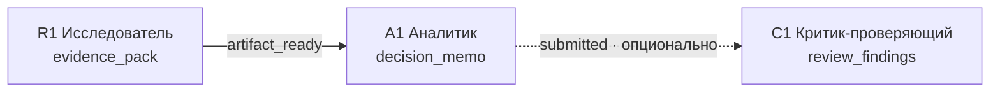
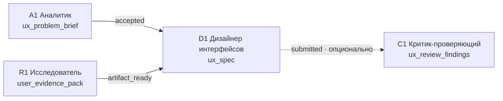
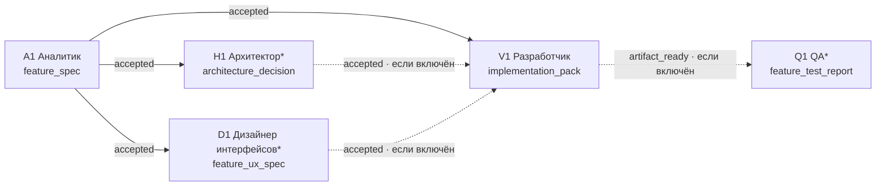
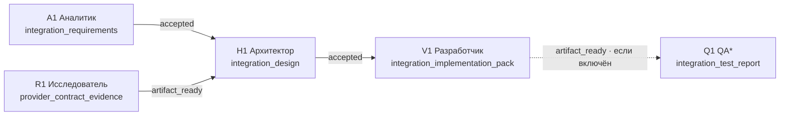
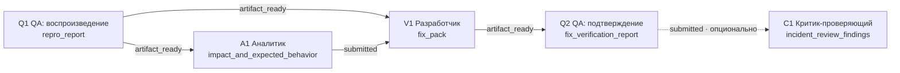
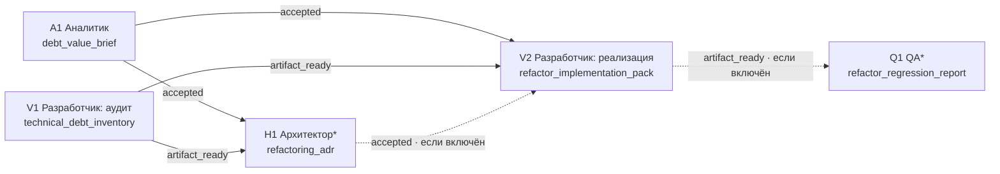
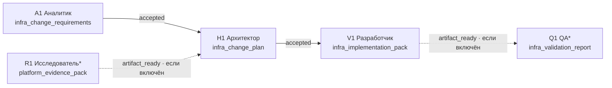
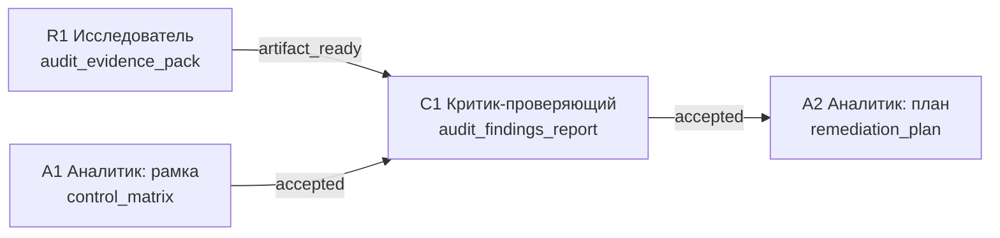
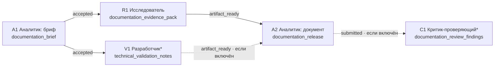
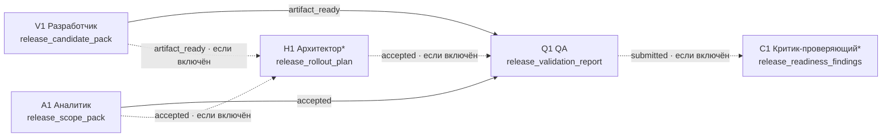

# TaskFlow — библиотека утверждённых шаблонов совместной работы

**Статус документа:** проект каталога  
**Целевая модель:** TaskFlow выбирает 2–3 *версии утверждённых шаблонов*, объясняет владельцу релевантность и запускает граф только после его ручного утверждения. Оркестратор не является узлом исполнения: он не выполняет работу, не создаёт произвольные роли и не «достраивает» граф на ходу.

## 0. Общие соглашения

### 0.1. Границы ролей

Используются только следующие исполняющие роли: **Исследователь, Аналитик, Архитектор, Дизайнер интерфейсов, Разработчик, QA, Критик-проверяющий**. Один и тот же тип роли может появляться в шаблоне повторно лишь как разные, явно названные узлы с различным артефактом (например, `Разработчик: диагностика` и `Разработчик: исправление`).

### 0.2. Контекст и артефакты

Каждый узел получает **контекстный пакет**, а не историю чата:

```yaml
context_packet:
  task_brief: цель, границы, владелец, срок, ограничения
  accepted_artifacts: только перечисленные версии входных артефактов
  facts_and_links: проверяемые факты, ссылки, репозиторий/среда при необходимости
  decision_criteria: критерии, по которым будет принят результат
  unresolved_questions: открытые вопросы от предшественников
```

Каждый артефакт имеет `artifact_id`, версию, автора, формат, список допущений, доказательства/ссылки, открытые вопросы и статус. Формулировка «роль завершила работу» **не является артефактом**.

### 0.3. Значения условий перехода

| Условие | Значение |
|---|---|
| `artifact_ready` | Артефакт существует, прошёл проверку структуры/полноты и может быть использован дальше без предметного одобрения. |
| `submitted` | Автор передал артефакт получателю; следующий узел может начать подготовительную работу, но не принимает необратимых решений на его основе. |
| `accepted` | Назначенный проверяющий или владелец принял конкретную версию артефакта по критериям. |

`accepted` не следует трактовать как глобальное разрешение на запуск проекта. Сначала владелец утверждает выбранную версию шаблона и стартовый бриф; затем внутри уже утверждённого графа применяются указанные ниже условия перехода. При существенной смене цели, рисков, объёма или состава ролей оркестратор предлагает **новую версию плана**, а не изменяет работающий DAG незаметно.

---

## 1. Каталог шаблонов

| ID / версия | Шаблон | Краткое назначение | Типовые сигналы | Основные роли | Минимальный контур |
|---|---|---|---|---|---|
| T01 / 1.0 | Исследование и обоснование решения | Собрать доказательства и оформить решение/рекомендацию | «исследовать», «сравнить», «выбрать», неизвестность | Исследователь, Аналитик; Критик опционально | Исследователь → Аналитик |
| T02 / 1.0 | UX-концепт пользовательского сценария | Сформировать проверяемую UX-концепцию до разработки | «экран», «путь пользователя», «прототип», «онбординг» | Аналитик, Исследователь, Дизайнер интерфейсов; Критик опционально | Аналитик → Дизайнер интерфейсов |
| T03 / 1.1 | Продуктовая фича | Специфицировать, спроектировать, реализовать и проверить новую функцию | «добавить возможность», пользовательская ценность, acceptance criteria | Аналитик, Архитектор*, Дизайнер интерфейсов*, Разработчик, QA* | Аналитик → Разработчик |
| T04 / 1.0 | API-интеграция | Подключить внешний/внутренний API с контрактом и обработкой отказов | «интеграция», «webhook», «OAuth», «синхронизация» | Исследователь, Аналитик, Архитектор, Разработчик, QA* | Аналитик + Исследователь → Архитектор → Разработчик |
| T05 / 1.1 | Баг или регрессия | Воспроизвести дефект, установить причину, исправить и не допустить повторения | «сломалось», «регрессия», «ошибка», «после релиза» | QA, Аналитик, Разработчик; Критик опционально | QA → Разработчик → QA |
| T06 / 1.0 | Технический долг / рефакторинг | Снизить измеримый технический риск без непреднамеренной смены поведения | «рефакторинг», «долг», «устарело», «дублирование» | Аналитик, Разработчик (инвентаризация и реализация), Архитектор*, QA* | Аналитик + Разработчик-аудит → Разработчик-реализация |
| T07 / 1.0 | Инфраструктурное изменение | Спроектировать и безопасно внедрить изменение среды/платформы | «CI/CD», «окружение», «миграция инфраструктуры», «доступы», «наблюдаемость» | Аналитик, Исследователь*, Архитектор, Разработчик, QA* | Аналитик → Архитектор → Разработчик |
| T08 / 1.0 | Аудит и план корректирующих действий | Независимо проверить соответствие требованиям и подготовить приоритетный план | «аудит», «проверить соответствие», «риски», «gap analysis» | Исследователь, Аналитик, Критик-проверяющий | Аналитик → Критик-проверяющий |
| T09 / 1.0 | Документация и база знаний | Создать или актуализировать проверяемую документацию для конкретной аудитории | «документация», «гайд», «runbook», «README» | Аналитик, Исследователь, Разработчик*, Критик-проверяющий* | Аналитик → Исследователь → Аналитик |
| T10 / 1.0 | Выпуск / релиз | Сформировать релиз-кандидат, проверить его и передать владельцу пакет решения о выпуске | «релиз», «выпуск», «версии», «release candidate», «rollout» | Разработчик, Аналитик, QA, Архитектор*, Критик-проверяющий* | Разработчик + Аналитик → QA |

`*` — роль включается только при указанном в описании условии, а не по умолчанию.

---

# 2. Подробные спецификации

## T01 / 1.0 — Исследование и обоснование решения

**Назначение.** Получить воспроизводимое исследование и решение, пригодное для выбора владельцем; не начинать реализацию до снятия ключевой неопределённости.

### Когда выбирать

- **Признаки в задаче:** нужно сравнить варианты, подтвердить гипотезу, найти причины, оценить подход или собрать внешние/внутренние свидетельства.
- **Ключевые слова и теги:** `research`, `discovery`, `compare`, `evaluate`, `выбор`, `исследование`, `гипотеза`, `почему`, `альтернативы`.
- **Риски и ограничения:** высокая неопределённость, важное решение, ограниченный срок, риск ложных/устаревших источников; возможен Критик для решений с высокой стоимостью ошибки.
- **Не выбирать:** если результат уже известен и требуется только реализовать его; для воспроизводимого дефекта использовать T05; для формального контроля соответствия — T08.

### Граф ролей

**Роли:** Исследователь → Аналитик; Критик-проверяющий опционально после аналитического вывода.  
**Параллельность:** отсутствует намеренно: рамка исследования и итоговый вывод опираются на единый набор доказательств.  
**Зависимости:** Аналитик зависит от карты источников; Критик, если включён, зависит от decision memo.  
**Необязательная роль:** Критик-проверяющий — только при необратимом, дорогом или регулируемом выборе.

### Узлы

| Узел / роль | Конкретная работа | Входной контекст | Обязательный выходной артефакт | Формат результата | Как проверяется | Открытые вопросы дальше |
|---|---|---|---|---|---|---|
| R1 — Исследователь | Формулирует вопросы, собирает и ранжирует доказательства, фиксирует метод и противоречия | Бриф, границы поиска, критерии достоверности, срок | `evidence_pack` — карта источников и фактов | Markdown/YAML: вопрос → утверждение → источник → дата → уверенность | Полнота по вопросам, ссылки доступны, отделены факты и допущения | Пробелы доказательств, противоречия, факты с низкой уверенностью |
| A1 — Аналитик | Синтезирует варианты, trade-off и рекомендацию | `evidence_pack`, критерии решения, ограничения | `decision_memo` | Markdown: варианты, матрица критериев, рекомендация, допущения | Каждое существенное утверждение ссылается на evidence; рекомендация выводится из критериев | Нужные решения владельца, условия пересмотра, остаточные риски |
| C1 — Критик-проверяющий *(опционально)* | Ищет некорректные выводы, неполные альтернативы и конфликт интересов | `decision_memo`, `evidence_pack`, критерии независимой проверки | `review_findings` | YAML/Markdown: finding, severity, evidence, requested correction | Находит проверяемые, а не вкусовые замечания; нет новых неподтверждённых утверждений | Критические замечания, что должен решить владелец |

### Рёбра

| От → к | Передаваемый артефакт | Условие | Почему зависимость нужна |
|---|---|---|---|
| R1 Исследователь → A1 Аналитик | `evidence_pack` | `artifact_ready` | Анализ должен опираться на прослеживаемые доказательства, а не на пересказ исследования. |
| A1 Аналитик → C1 Критик *(если включён)* | `decision_memo` + релевантные части `evidence_pack` | `submitted` | Критик проверяет аргументацию до фиксации решения; может начать с переданной версии. |

### Mermaid DAG



**Пример исходной задачи:** «Сравнить SSO-провайдеры для B2B-продукта, оценив соответствие SAML/OIDC, стоимость, переносимость и риски vendor lock-in; предложить один вариант».

**Критерии успеха всего шаблона:** все вопросы исследования покрыты; источники прослеживаемы; варианты сопоставлены по заранее объявленным критериям; рекомендация содержит допущения, риски и решение, требуемое от владельца.

**Минимальная версия:** R1 → A1. Критик не нужен для обратимого решения с низкой стоимостью ошибки.

**Риск неправильного подбора:** применение T01 вместо T03 задержит очевидную реализацию; применение T03 вместо T01 превратит предположения в требования и создаст дорогую переделку.

---

## T02 / 1.0 — UX-концепт пользовательского сценария

**Назначение.** Подготовить концепцию пользовательского опыта, которую можно отдать в разработку либо использовать для дальнейшей продуктовой фичи.

### Когда выбирать

- **Признаки в задаче:** неизвестен или спорен пользовательский путь, требуется сценарий/прототип/информационная структура, цель — понятность и удобство, а не доставка готовой функции.
- **Ключевые слова и теги:** `ux`, `ui`, `flow`, `wireframe`, `prototype`, `onboarding`, `экран`, `сценарий`, `форма`, `навигация`.
- **Риски и ограничения:** доступность, мобильные/desktop ограничения, несколько персон, существующий дизайн-системный контур; Исследователь нужен при нехватке пользовательских фактов, Критик — при регулируемых или критически важных действиях пользователя.
- **Не выбирать:** для чистого визуального косметического изменения без нового сценария; для реализации уже утверждённой UX-спеки — T03; для дефекта интерфейса с воспроизведением — T05.

### Граф ролей

**Роли:** Аналитик и Исследователь (если есть неизвестность о пользователях) параллельно; затем Дизайнер интерфейсов; затем Критик-проверяющий опционально.  
**Параллельность:** A1 описывает задачу и ограничения, R1 собирает пользовательские факты/референсы независимо.  
**Зависимости:** D1 нуждается в обоих пакетах, C1 — в UX-спеке.  
**Необязательные роли:** Исследователь — если проверенные инсайты уже есть; Критик — для потоков оплаты, юридического согласия, массовых коммуникаций или высокого accessibility-риска.

### Узлы

| Узел / роль | Конкретная работа | Входной контекст | Обязательный выходной артефакт | Формат результата | Как проверяется | Открытые вопросы дальше |
|---|---|---|---|---|---|---|
| A1 — Аналитик | Формирует JTBD, персоны/сегменты, бизнес-правила и критерии сценария | Бриф, метрики, известные требования, ограничения платформы | `ux_problem_brief` | YAML/Markdown: actor, trigger, outcome, rules, acceptance criteria | Нет смешения решения и потребности; критерии наблюдаемы | Неизвестные правила, приоритет конфликтующих целей |
| R1 — Исследователь *(опционально)* | Сводит пользовательские свидетельства, паттерны и требования доступности | Бриф, исследовательские вопросы, допустимые источники | `user_evidence_pack` | Таблица фактов/ссылок + выводы с уверенностью | Источники отделены от интерпретаций; выводы релевантны сценарию | Непроверенные предположения о пользователях |
| D1 — Дизайнер интерфейсов | Проектирует основной и ошибочные пути, состояния и UX-копирайтинг | `ux_problem_brief`, `user_evidence_pack` при наличии, дизайн-система | `ux_spec` | Ссылка на макеты + Markdown: flow, state matrix, accessibility notes | Все критерии A1 покрыты; есть пустые/ошибочные/загрузочные состояния; используются компоненты DS | Решения, требующие продуктового/технического согласования |
| C1 — Критик-проверяющий *(опционально)* | Проверяет сценарий на риск, понятность, доступность и соответствие правилам | `ux_spec`, `ux_problem_brief`, нормативные ограничения | `ux_review_findings` | Список замечаний с severity и привязкой к экрану/состоянию | Каждое замечание связано с критерием или правилом, а не с личным стилем | Блокирующие несоответствия и вопросы владельцу |

### Рёбра

| От → к | Передаваемый артефакт | Условие | Почему зависимость нужна |
|---|---|---|---|
| A1 Аналитик → D1 Дизайнер | `ux_problem_brief` | `accepted` | Дизайн не должен выбирать продуктовую цель или бизнес-правила сам. |
| R1 Исследователь → D1 Дизайнер | `user_evidence_pack` | `artifact_ready` | Дизайнер использует факты о пользователях без ожидания субъективного одобрения. |
| D1 Дизайнер → C1 Критик *(если включён)* | `ux_spec` | `submitted` | Независимая проверка нужна до фиксации концепта в следующем шаблоне. |

### Mermaid DAG



**Пример исходной задачи:** «Спроектировать первый сценарий приглашения коллеги в рабочее пространство TaskFlow, чтобы администратор мог дать минимальные права без путаницы в ролях».

**Критерии успеха:** есть проверяемый основной сценарий и состояния ошибок; бизнес-правила и доступность отражены; макеты/спека покрывают условия приёмки; незафиксированные решения явно вынесены владельцу.

**Минимальная версия:** A1 → D1. Если уже есть утверждённый UX-бриф и доказательства, начинается с D1; R1 и C1 не включаются автоматически.

**Риск неправильного подбора:** T02 вместо T03 оставит дизайн без реализации и тестов; T03 вместо T02 для неопределённого сценария спровоцирует кодирование недоказанного UX.

---

## T03 / 1.1 — Продуктовая фича

**Назначение.** Доставить ограниченную новую возможность от требований до проверяемого инкремента, не превращая любой запрос в обязательную архитектурную или дизайн-работу.

### Когда выбирать

- **Признаки в задаче:** появляется новая пользовательская/бизнес-возможность, нужны явные условия приёмки, есть ограниченный delivery scope.
- **Ключевые слова и теги:** `feature`, `MVP`, `user story`, `добавить`, `возможность`, `acceptance criteria`, `фича`.
- **Риски и ограничения:** изменение данных, публичного API, ролей/прав, платёжных/регулируемых действий, значимая UX-новизна. Архитектор обязателен только при кросс-сервисном, контрактном, миграционном или существенном NFR-изменении; Дизайнер — при новом/существенно меняющемся пользовательском пути; QA — при пользовательском, интеграционном или регрессионно-опасном изменении.
- **Не выбирать:** если цель — выяснить, *нужна ли* функция (T01); если это исправление установленного дефекта (T05); если центральный результат — интеграционный контракт (T04).

### Граф ролей

**Роли:** Аналитик; после него Архитектор и/или Дизайнер интерфейсов идут параллельно по триггеру; затем Разработчик; затем QA при риске поведения/регрессии.  
**Параллельность:** архитектурная и UX-ветки независимы после принятия требований.  
**Зависимости:** Разработчик ждёт только релевантные спеку/решение; QA получает реализованный инкремент и критерии, не полный проектный чат.  
**Необязательные роли:** Архитектор, Дизайнер, QA — по чётким условиям выше; Критик не включается «для качества».

### Узлы

| Узел / роль | Конкретная работа | Входной контекст | Обязательный выходной артефакт | Формат результата | Как проверяется | Открытые вопросы дальше |
|---|---|---|---|---|---|---|
| A1 — Аналитик | Уточняет ценность, границы, правила, нефункциональные критерии и acceptance criteria | Стартовый бриф, существующие процессы, метрики, ограничения | `feature_spec` | YAML/Markdown: scope, out_of_scope, rules, AC, NFR, analytics events | Каждый AC тестируем; scope/out-of-scope не противоречат друг другу | Решения владельца, неизвестные правила, зависимости |
| H1 — Архитектор *(по триггеру)* | Выбирает технический подход, миграции, контракты, отказоустойчивость | `feature_spec`, текущая архитектура, контракты/ограничения | `architecture_decision` | ADR: контекст, варианты, решение, последствия, rollout/rollback | Покрыты NFR и риски; решение реализуемо в scope | Открытые техриски, решения по данным/контрактам |
| D1 — Дизайнер интерфейсов *(по триггеру)* | Описывает интерфейс, состояния и доступность нового сценария | `feature_spec`, дизайн-система, UX-исследование если имеется | `feature_ux_spec` | Макеты + state matrix + UX-копирайтинг | Все пользовательские AC покрыты; состояния ошибок определены | Неясные правила, требующие A1/владельца |
| V1 — Разработчик | Реализует ограниченный инкремент и самопроверки | `feature_spec`, `architecture_decision` если есть, `feature_ux_spec` если есть, репозиторий | `implementation_pack` | Ссылка на изменения + build ID + миграции + unit/integration test report + deployment notes | Сборка проходит, изменения сопоставлены с AC, тесты воспроизводимы | Известные ограничения, риски rollout, не покрытые AC |
| Q1 — QA *(по триггеру)* | Проверяет AC, интеграции и релевантную регрессию на кандидате | `implementation_pack`, `feature_spec`, UX-состояния при наличии | `feature_test_report` | Матрица AC → результат → доказательство; defects с severity | Все критические AC имеют evidence; дефекты воспроизводимы | Blocker/known issues, покрытие, рекомендации по выпуску |

### Рёбра

| От → к | Передаваемый артефакт | Условие | Почему зависимость нужна |
|---|---|---|---|
| A1 → H1 *(если включён)* | `feature_spec` | `accepted` | Архитектурное решение должно решать принятые требования, а не угадывать их. |
| A1 → D1 *(если включён)* | `feature_spec` | `accepted` | UX-спека обязана покрывать утверждённые правила и сценарии. |
| A1 → V1 | `feature_spec` | `accepted` | Реализация начинается только с тестируемым scope. |
| H1 → V1 *(если включён)* | `architecture_decision` | `accepted` | Избегает самостоятельного выбора критических контрактов/миграций разработчиком. |
| D1 → V1 *(если включён)* | `feature_ux_spec` | `accepted` | Предотвращает расхождение реализации с UX-концептом. |
| V1 → Q1 *(если включён)* | `implementation_pack` | `artifact_ready` | QA нужен запускаемый кандидат и доказательства self-check, а не просто сообщение о готовности. |

### Mermaid DAG



**Пример исходной задачи:** «Добавить в TaskFlow возможность сохранить утверждённый шаблон как новую версию, показать diff графа и разрешить запуск только версии, выбранной владельцем».

**Критерии успеха:** принятый scope и AC; инкремент соответствует входным контрактам/UX; для включённого QA все критические AC имеют доказательства; известные ограничения и rollout-план прозрачны владельцу.

**Минимальная версия:** A1 → V1. Архитектор, Дизайнер и QA добавляются только по указанным триггерам; их отсутствие должно быть обосновано в `feature_spec`.

**Риск неправильного подбора:** упрощение крупной интеграционной или миграционной работы до T03 без H1 приводит к неявным контрактным решениям; применение T03 к малому багу создаёт ненужную спецификацию и задержку.

---

## T04 / 1.0 — API-интеграция

**Назначение.** Подключить внешний или внутренний API с явным контрактом, моделью отказов, безопасностью и проверяемой совместимостью.

### Когда выбирать

- **Признаки в задаче:** есть два системных контура, запросы/события/webhook, авторизация, синхронизация или контракт данных.
- **Ключевые слова и теги:** `API`, `webhook`, `OAuth`, `SAML`, `SDK`, `sync`, `callback`, `интеграция`, `контракт`, `провайдер`.
- **Риски и ограничения:** лимиты провайдера, PII/секреты, идемпотентность, versioning, retries, sandbox, vendor SLA. QA включается при реальной тестовой среде или любом пишущем/финансовом/критичном потоке.
- **Не выбирать:** для функции без внешнего/межсервисного контракта — T03; для исследовательского сравнения провайдеров до выбора — T01; для инфраструктурного развёртывания без интеграционной логики — T07.

### Граф ролей

**Роли:** Аналитик и Исследователь параллельно → Архитектор → Разработчик → QA опционально.  
**Параллельность:** A1 фиксирует бизнес-объём/данные, R1 извлекает фактический контракт и ограничения поставщика.  
**Зависимости:** Архитектор сводит оба пакета; Разработчик получает ADR и контрактный набор; QA — исполнимый контракт и кандидата.  
**Необязательная роль:** QA только для read-only, изолированной интеграции без пользовательского/операционного риска при наличии достаточных контрактных автотестов.

### Узлы

| Узел / роль | Конкретная работа | Входной контекст | Обязательный выходной артефакт | Формат результата | Как проверяется | Открытые вопросы дальше |
|---|---|---|---|---|---|---|
| A1 — Аналитик | Определяет бизнес-поток, владельцев данных, допустимые операции и AC | Бриф, политики данных, существующие процессы | `integration_requirements` | YAML: flows, source_of_truth, data classes, AC, out_of_scope | Для каждого потока определены данные, инициатор и ожидаемый исход | Владение данными, неразрешённые правила |
| R1 — Исследователь | Извлекает фактический контракт, auth, лимиты, версии, sandbox и SLA | Документация/репозиторий API, вопросы к провайдеру | `provider_contract_evidence` | OpenAPI/ссылки + таблица endpoint/event, limits, auth, evidence | У каждого ограничения есть источник и дата; версии контракта зафиксированы | Неясности/расхождения документации и sandbox |
| H1 — Архитектор | Проектирует адаптер, маппинг, ошибки, retries, идемпотентность, observability и migration | `integration_requirements`, `provider_contract_evidence`, текущая архитектура | `integration_design` | ADR + контрактная спецификация + sequence diagram | Покрыты безопасность, отказные сценарии, совместимость и владелец данных | Риски провайдера, решения по секретам/лимитам |
| V1 — Разработчик | Реализует интеграцию, mocks/contract tests и операционные метрики | `integration_design`, релевантные требования, репозиторий | `integration_implementation_pack` | Изменения, build ID, contract-test report, dashboard/runbook links | Contract tests проходят; нет секретов в артефактах; телеметрия определена | Известные различия sandbox/prod, rollout действия |
| Q1 — QA *(по триггеру)* | Проверяет жизненный поток, ошибки, повторную доставку и совместимость | `integration_implementation_pack`, `integration_requirements`, тестовые учётные данные/среда | `integration_test_report` | Матрица flow/error case → результат/evidence | Критические потоки и отказные сценарии воспроизведены | Блокеры, остаточные риски, ограничения провайдера |

### Рёбра

| От → к | Передаваемый артефакт | Условие | Почему зависимость нужна |
|---|---|---|---|
| A1 → H1 | `integration_requirements` | `accepted` | Технический дизайн не должен самостоятельно определять бизнес-владение и допустимые операции. |
| R1 → H1 | `provider_contract_evidence` | `artifact_ready` | Архитектору нужны проверенные факты контракта и лимитов. |
| H1 → V1 | `integration_design` | `accepted` | Избегает импровизации в auth, retries и маппинге данных. |
| V1 → Q1 *(если включён)* | `integration_implementation_pack` | `artifact_ready` | QA проверяет реальный кандидат с контрактными доказательствами. |

### Mermaid DAG



**Пример исходной задачи:** «Интегрировать TaskFlow с корпоративным IdP по SCIM: синхронизировать пользователей и группы, не отключая пользователей при временных ошибках провайдера».

**Критерии успеха:** источник истины и классы данных однозначны; контракт и версия доказаны; дизайн покрывает auth/лимиты/повторы/наблюдаемость; контрактные и, при включении QA, сквозные проверки воспроизводимы.

**Минимальная версия:** A1 + R1 → H1 → V1. Убирать Архитектора нельзя: контракт и отказные сценарии — центральный результат шаблона.

**Риск неправильного подбора:** T03 без контрактной ветки недооценит внешние лимиты и идемпотентность; T04 для внутреннего локального изменения создаст непропорционную церемонию.

---

## T05 / 1.1 — Баг или регрессия

**Назначение.** Воспроизвести наблюдаемый дефект, отделить факты от предположений, исправить коренную причину и подтвердить отсутствие целевой регрессии.

### Когда выбирать

- **Признаки в задаче:** уже есть ожидаемое и фактическое поведение, версия/дата появления, ошибка, инцидент или регрессия после изменения.
- **Ключевые слова и теги:** `bug`, `defect`, `regression`, `broken`, `error`, `не работает`, `регрессия`, `исправить`.
- **Риски и ограничения:** неполный repro, продакшен-данные, риск ухудшить другой сценарий; Критик добавляется только при спорном root cause, безопасности или повторяющемся инциденте с высокой стоимостью.
- **Не выбирать:** когда неизвестно, является ли наблюдение дефектом или новым требованием — T01/T03; для планового снижения долга — T06.

### Граф ролей

**Роли:** QA воспроизводит → Аналитик параллельно уточняет бизнес-влияние и приоритет, затем Разработчик исправляет → QA подтверждает исправление; Критик опционально после отчёта.  
**Параллельность:** после исходного воспроизведения A1 и V1-диагностика могли бы идти параллельно, но узел диагностики объединён с исправлением, чтобы не создавать ложную передачу между одной и той же ролью. A1 может работать параллельно с V1 после `repro_report`.  
**Зависимости:** V1 требует воспроизводимый отчёт; финальный Q2 получает кандидата и исходный repro; C1 зависит от постмортем-выдержки.  
**Необязательная роль:** Критик-проверяющий — по условиям риска выше.

### Узлы

| Узел / роль | Конкретная работа | Входной контекст | Обязательный выходной артефакт | Формат результата | Как проверяется | Открытые вопросы дальше |
|---|---|---|---|---|---|---|
| Q1 — QA: воспроизведение | Подтверждает дефект, минимизирует шаги, фиксирует окружение и ожидаемое/фактическое поведение | Тикет, логи/скриншоты, версия, доступная среда | `repro_report` | YAML: preconditions, steps, expected, actual, environment, evidence, frequency | Другой исполнитель способен повторить; нет скрытых шагов | Что ещё влияет на проявление, где недостаточно доказательств |
| A1 — Аналитик | Определяет затронутый поток, серьёзность, приоритет и ожидаемое правило | `repro_report`, бриф, метрики/политики | `impact_and_expected_behavior` | Markdown/YAML: affected users, business rule, severity rationale, AC fix | Severity обоснована; ожидаемое поведение не придумано без источника | Неясные правила/исключения |
| V1 — Разработчик: диагностика и исправление | Находит root cause, вносит минимальное исправление и защитный тест | `repro_report`, `impact_and_expected_behavior` по готовности, код/логи | `fix_pack` | Root-cause note + diff/build ID + automated tests + migration/rollback note | Root cause подтверждён evidence; тест падал до и проходит после исправления | Остаточный риск, побочные эффекты, гипотезы для наблюдения |
| Q2 — QA: подтверждение | Повторяет исходный repro на кандидате и проверяет ограниченную регрессию | `fix_pack`, `repro_report`, `impact_and_expected_behavior` | `fix_verification_report` | Матрица: исходный defect, AC, regression checks, evidence | Исходный дефект устранён в целевой среде; результаты воспроизводимы | Непроверенные платформы/пограничные случаи |
| C1 — Критик-проверяющий *(опционально)* | Проверяет достаточность root-cause и мер против повторения | `fix_pack`, `fix_verification_report`, релевантные инциденты | `incident_review_findings` | Findings с evidence и preventive actions | Замечания относятся к причине/контролю, не к предпочтению реализации | Изменения процесса/мониторинга, требующие владельца |

### Рёбра

| От → к | Передаваемый артефакт | Условие | Почему зависимость нужна |
|---|---|---|---|
| Q1 → A1 | `repro_report` | `artifact_ready` | Оценка влияния опирается на подтверждённый факт, а не на описание из тикета. |
| Q1 → V1 | `repro_report` | `artifact_ready` | Разработчик не тратит время на неповторяемую проблему. |
| A1 → V1 | `impact_and_expected_behavior` | `submitted` | Может уточнить expected behavior, не блокируя первичную техническую диагностику. |
| V1 → Q2 | `fix_pack` | `artifact_ready` | Для подтверждения нужен конкретный кандидат и автоматические доказательства. |
| Q2 → C1 *(если включён)* | `fix_verification_report` + `fix_pack` | `submitted` | Критик оценивает достаточность предотвращения после фактической проверки. |

### Mermaid DAG



**Пример исходной задачи:** «После версии 2.8 владелец шаблона видит кнопку “Запустить” для черновой версии, хотя запуск должен быть разрешён только для утверждённой».

**Критерии успеха:** исходный дефект воспроизводился и устранён; правило ожидаемого поведения подтверждено; root cause объяснена; автоматическая защита и целевая регрессия проверены; остаточный риск явно зафиксирован.

**Минимальная версия:** Q1 → V1 → Q2. Аналитик можно убрать, если ожидаемое поведение уже однозначно закреплено в принятом контракте/тесте; Критик — только для серьёзных случаев.

**Риск неправильного подбора:** T03 вместо T05 может превратить срочное восстановление в длинное проектирование; T05 вместо T03 закрепит симптом, когда на деле нужно изменить продуктовое правило.

---

## T06 / 1.0 — Технический долг / рефакторинг

**Назначение.** Снизить измеримый технический риск или стоимость изменений, сохранив заявленное поведение и не маскируя продуктовую фичу под «рефакторинг».

### Когда выбирать

- **Признаки в задаче:** устаревшая зависимость, дублирование, сложный модуль, нестабильные тесты, невыполнимое обновление, накопленный operational risk; внешний функциональный контракт должен сохраниться.
- **Ключевые слова и теги:** `tech-debt`, `refactor`, `deprecated`, `upgrade`, `cleanup`, `flaky`, `технический долг`, `рефакторинг`, `устаревшее`.
- **Риски и ограничения:** скрытая смена поведения, масштаб влияния, миграция, обратная совместимость. Архитектор включается при смене границ компонентов, данных или контрактов; QA — когда нет надёжного автоматического regression safety net либо затронут критичный поток.
- **Не выбирать:** для новой ценности — T03; для найденного дефекта — T05; для платформенного/средового изменения — T07.

### Граф ролей

**Роли:** Аналитик и Разработчик-аудит параллельно → Архитектор опционально → Разработчик-реализация → QA опционально.  
**Параллельность:** A1 измеряет стоимость/влияние, V1 делает технический инвентарь независимо; они сходятся в решении H1 или в реализации при отсутствии архитектурного триггера.  
**Зависимости:** реализация зависит от обоих базовых артефактов и ADR при наличии.  
**Необязательные роли:** Архитектор и QA — только по отмеченным триггерам.

### Узлы

| Узел / роль | Конкретная работа | Входной контекст | Обязательный выходной артефакт | Формат результата | Как проверяется | Открытые вопросы дальше |
|---|---|---|---|---|---|---|
| A1 — Аналитик | Формулирует измеримый долг, влияние, границы сохранения поведения и приоритет | Бриф, инциденты, delivery metrics, обязательства | `debt_value_brief` | Markdown: problem metric, baseline, expected benefit, protected behavior, scope | Есть baseline и критерий завершения; выгода не декларируется без измерения | Приоритет, допустимое окно изменений |
| V1 — Разработчик: технический аудит | Строит карту зависимостей, hotspots, тестового покрытия и вариантов работ | Репозиторий, логи, `debt_value_brief` по готовности | `technical_debt_inventory` | YAML: components, risks, effort range, tests, migration needs | Ссылки на код/метрики; риски различаются по severity | Неизвестные связи, слабые тестовые зоны |
| H1 — Архитектор *(по триггеру)* | Определяет целевую границу, стратегию миграции и обратную совместимость | `debt_value_brief`, `technical_debt_inventory`, текущая архитектура | `refactoring_adr` | ADR + transition plan + rollback | Покрыты границы, данные и compatibility; этапы обратимы | Триггеры остановки/отката |
| V2 — Разработчик: реализация | Выполняет рефакторинг/обновление и усиливает защитные тесты | `debt_value_brief`, `technical_debt_inventory`, `refactoring_adr` при наличии | `refactor_implementation_pack` | Diff/build ID, test report, before/after metrics, migration note | Protected behavior tests проходят; заявленная метрика сравнима с baseline | Неохваченные области, остаточный долг |
| Q1 — QA *(по триггеру)* | Проверяет сохранность критических пользовательских/интеграционных потоков | `refactor_implementation_pack`, `debt_value_brief` | `refactor_regression_report` | Сценарии → доказательства → verdict | Критические protected behaviors не изменились | Непроверенные варианты среды/данных |

### Рёбра

| От → к | Передаваемый артефакт | Условие | Почему зависимость нужна |
|---|---|---|---|
| A1 → H1 *(если включён)* | `debt_value_brief` | `accepted` | Архитектурный выбор должен сохранять объявленное поведение и решать приоритетную боль. |
| V1 → H1 *(если включён)* | `technical_debt_inventory` | `artifact_ready` | ADR требует фактической карты рисков и зависимостей. |
| A1 → V2 | `debt_value_brief` | `accepted` | Защищает от скрытой смены продукта под видом рефакторинга. |
| V1 → V2 | `technical_debt_inventory` | `artifact_ready` | Реализация основана на инвентаре, а не на локальном впечатлении. |
| H1 → V2 *(если включён)* | `refactoring_adr` | `accepted` | Требуется при миграциях/смене границ. |
| V2 → Q1 *(если включён)* | `refactor_implementation_pack` | `artifact_ready` | QA сравнивает проверяемый кандидат с защищаемым поведением. |

### Mermaid DAG



**Пример исходной задачи:** «Убрать устаревший модуль обхода версий графа, который дублирует правила в трёх сервисах и делает невозможным обновление SDK без ручных патчей; внешний API не менять».

**Критерии успеха:** долг измерен до/после; заявленное поведение защищено тестами; миграция/откат определены при необходимости; нет неоговорённой смены внешнего контракта; остаточный долг видим.

**Минимальная версия:** A1 + V1 → V2. H1 и Q1 не добавляются, если границы/контракты не меняются и автоматическое покрытие защищаемого поведения достаточно.

**Риск неправильного подбора:** T06 вместо T03 позволит незаметно добавить функциональные изменения без требований; T03 вместо T06 искусственно создаст UX/продуктовые артефакты и не докажет снижение долга.

---

## T07 / 1.0 — Инфраструктурное изменение

**Назначение.** Безопасно изменить среду, пайплайн, доступность, наблюдаемость или базовую платформу с явными SLO, планом внедрения и отката.

### Когда выбирать

- **Признаки в задаче:** CI/CD, окружения, сеть, секреты, наблюдаемость, ресурсы, backup/restore, миграция платформы, доступы, SLO.
- **Ключевые слова и теги:** `infra`, `CI/CD`, `Kubernetes`, `Terraform`, `deployment`, `observability`, `SLO`, `backup`, `окружение`, `доступы`.
- **Риски и ограничения:** простой, безопасность, потеря данных, бюджет, change window, соответствие политикам. Исследователь включается при новом провайдере/технологии или неясных ограничениях; QA — когда возможно испытать change/rollback в приближённой среде.
- **Не выбирать:** для интеграционной прикладной логики — T04; для обычного обновления кода без изменения среды — T03/T06; для анализа причины сбоя до изменений — T05 или T01.

### Граф ролей

**Роли:** Аналитик и Исследователь (по необходимости) → Архитектор → Разработчик → QA (по необходимости).  
**Параллельность:** R1 может собирать vendor/platform evidence параллельно с A1, который фиксирует операционные критерии.  
**Зависимости:** H1 использует требования и технические ограничения; V1 — утверждённый plan/runbook; QA — change candidate и rollback evidence.  
**Необязательные роли:** Исследователь и QA по условиям выше; Дизайнер интерфейсов и Критик не применяются по умолчанию.

### Узлы

| Узел / роль | Конкретная работа | Входной контекст | Обязательный выходной артефакт | Формат результата | Как проверяется | Открытые вопросы дальше |
|---|---|---|---|---|---|---|
| A1 — Аналитик | Фиксирует затрагиваемые сервисы, SLO/SLA, change window, владельцев и критерии готовности | Бриф, инциденты, service catalogue, политики | `infra_change_requirements` | YAML: services, SLO, RTO/RPO, constraints, success/abort criteria | Есть владельцы, измеримые критерии, окно и ограничения | Конфликты приоритетов, неясные владельцы |
| R1 — Исследователь *(по триггеру)* | Проверяет возможности платформы/провайдера, лимиты, совместимость и стоимость | Документация, тарифы, текущая конфигурация | `platform_evidence_pack` | Таблица capabilities/limits/cost/evidence | Дата/версия источников указана; факты отделены от выбора | Неясности у поставщика, предположения нагрузки |
| H1 — Архитектор | Проектирует изменение, безопасные этапы, security controls, мониторинг, rollback и аварийный stop | `infra_change_requirements`, `platform_evidence_pack` при наличии, текущая топология | `infra_change_plan` | ADR + runbook + rollout/rollback plan + observability checklist | Есть pre-checks, abort thresholds, rollback, владельцы команд | Операционные решения и непокрытые риски |
| V1 — Разработчик | Вносит инфраструктурные изменения как код, запускает pre-checks и готовит кандидата | `infra_change_plan`, репозиторий IaC/пайплайны, доступы | `infra_implementation_pack` | IaC diff, plan/apply output, build/deploy ID, pre-check evidence | Изменения воспроизводимы; секреты не раскрыты; pre-checks проходят | Drift/ручные действия, ограничения среды |
| Q1 — QA *(по триггеру)* | Валидирует критические операции, мониторинг и rollback в тестовом/канареечном контуре | `infra_implementation_pack`, `infra_change_plan` | `infra_validation_report` | Проверки SLO/health/rollback → evidence | Success/abort criteria измерены; rollback проверен, где безопасно | Непроверяемые в staging риски, условия production наблюдения |

### Рёбра

| От → к | Передаваемый артефакт | Условие | Почему зависимость нужна |
|---|---|---|---|
| A1 → H1 | `infra_change_requirements` | `accepted` | План изменения должен обслуживать конкретные SLO и окно, а не технологическое предпочтение. |
| R1 → H1 *(если включён)* | `platform_evidence_pack` | `artifact_ready` | Выбор платформенных опций опирается на проверяемые возможности/лимиты. |
| H1 → V1 | `infra_change_plan` | `accepted` | Инфраструктурное изменение требует явно принятого rollback и stop criteria. |
| V1 → Q1 *(если включён)* | `infra_implementation_pack` | `artifact_ready` | QA проверяет кандидата/канареечный контур, а не план. |

### Mermaid DAG



**Пример исходной задачи:** «Перевести nightly backup базы TaskFlow на новый регион хранения: сохранить RPO 24 часа, проверить восстановление и иметь откат без потери текущих резервных копий».

**Критерии успеха:** SLO и abort criteria измеримы; IaC/конфигурация воспроизводимы; rollback реалистичен; наблюдаемость подтверждает целевые свойства; ответственное лицо получает готовый runbook.

**Минимальная версия:** A1 → H1 → V1. Убирать H1 нельзя: план безопасного внедрения и rollback — суть задачи. R1 и Q1 вводятся только по конкретным триггерам.

**Риск неправильного подбора:** T03 может скрыть операционные/rollback-риски за обычной разработкой; T07 для локального параметра без SLO и среды даст лишнюю бюрократию.

---

## T08 / 1.0 — Аудит и план корректирующих действий

**Назначение.** Независимо проверить объект относительно явного стандарта/политики и подготовить доказательный, приоритизированный план действий; аудит сам по себе не исправляет объект.

### Когда выбирать

- **Признаки в задаче:** нужно оценить соответствие, найти gaps, проверить риски/контроли, подготовить рекомендации с доказательствами.
- **Ключевые слова и теги:** `audit`, `assessment`, `compliance`, `review`, `gap`, `risk`, `контроль`, `соответствие`, `аудит`.
- **Риски и ограничения:** независимость проверки, неполные доказательства, нормативные сроки, конфиденциальность. При необходимости реализации находок создаётся отдельный T03/T06/T07 после решения владельца.
- **Не выбирать:** для свободного исследования без стандарта — T01; для code review одной конкретной правки — использовать проверку внутри её шаблона; для исправления уже известного дефекта — T05.

### Граф ролей

**Роли:** Исследователь и Аналитик параллельно → Критик-проверяющий → Аналитик: план действий.  
**Параллельность:** R1 собирает evidence, A1 формализует контрольную матрицу и область проверки независимо.  
**Зависимости:** Критик получает оба артефакта; A2 превращает только подтверждённые findings в план.  
**Необязательные роли:** нет в полном аудите; Разработчик/QA не добавляются, потому что исправление не часть аудита.

### Узлы

| Узел / роль | Конкретная работа | Входной контекст | Обязательный выходной артефакт | Формат результата | Как проверяется | Открытые вопросы дальше |
|---|---|---|---|---|---|---|
| R1 — Исследователь | Собирает доказательства о фактическом состоянии объекта | Scope, доступные системы/документы, правила доступа | `audit_evidence_pack` | Реестр evidence: item, source, timestamp, scope, integrity note | Evidence привязано к объекту и времени; пробелы отмечены | Недостающие/недоступные доказательства |
| A1 — Аналитик: контрольная рамка | Декомпозирует стандарт на проверяемые controls и критерии | Scope, стандарт/политики, предыдущие аудиты | `control_matrix` | Таблица control → criterion → expected evidence → severity rule | Каждый control проверяем и относится к scope | Неоднозначные нормы, исключения |
| C1 — Критик-проверяющий | Независимо сопоставляет evidence и controls, формулирует findings | `audit_evidence_pack`, `control_matrix` | `audit_findings_report` | Finding, criterion, evidence, gap, severity, confidence | Нет finding без критерия и evidence; confidence учитывает пробелы | Спорные findings, запросы уточнения |
| A2 — Аналитик: план действий | Приоритизирует подтверждённые findings, предлагает owner, срок, рекомендуемый следующий шаблон | `audit_findings_report`, ограничения, risk appetite | `remediation_plan` | YAML/Markdown: finding → action → owner → priority → dependency → suggested_template | Действия различают устранение, принятие риска и сбор доп. evidence | Решения владельца, бюджет/сроки, accepted risks |

### Рёбра

| От → к | Передаваемый артефакт | Условие | Почему зависимость нужна |
|---|---|---|---|
| R1 → C1 | `audit_evidence_pack` | `artifact_ready` | Независимая оценка строится на фиксированных доказательствах. |
| A1 → C1 | `control_matrix` | `accepted` | Критик не должен самовольно менять стандарт проверки. |
| C1 → A2 | `audit_findings_report` | `accepted` | План действий должен базироваться только на подтверждённых findings. |

### Mermaid DAG



**Пример исходной задачи:** «Провести аудит библиотеки шаблонов TaskFlow на соответствие правилу: каждый узел имеет конкретный артефакт, а каждый запуск требует явного утверждения версии владельцем».

**Критерии успеха:** scope и стандарт неизменны/прослеживаемы; evidence привязаны к каждому finding; severity объяснена; план различает обязательные действия, дополнительные исследования и принятие риска.

**Минимальная версия:** A1 → C1 → A2, если объект и доказательства уже собраны и доступны. Полная версия предпочтительна, когда доказательства нужно добывать специально.

**Риск неправильного подбора:** T08 вместо T06/T07 создаст отчёт без исправления; T01 вместо T08 даст интересные выводы, но лишит их нормативной проверяемости и независимости.

---

## T09 / 1.0 — Документация и база знаний

**Назначение.** Создать актуальный, ориентированный на аудиторию документ, где утверждения проверяемы, а процедура воспроизводима. Отдельной роли «технический писатель» нет: работу делят существующие роли.

### Когда выбирать

- **Признаки в задаче:** нужен README, guide, runbook, справочник, FAQ, описание API или процесса; известны читатели и предмет документа.
- **Ключевые слова и теги:** `docs`, `documentation`, `README`, `runbook`, `guide`, `manual`, `документация`, `инструкция`, `база знаний`.
- **Риски и ограничения:** устаревшие факты, конфиденциальность, безопасность команд, версия продукта. Разработчик включается только для кодовых/API/операционных фактов; Критик — для критичных инструкций, внешней документации или изменений с высокой ценой ошибки.
- **Не выбирать:** если сначала надо определить решение/политику — T01; если нужно изменить систему, а не описать её — T03/T06/T07; для выпуска пакета готовности — T10.

### Граф ролей

**Роли:** Аналитик определяет аудиторию и структуру → Исследователь собирает факты; Разработчик (при техническом предмете) подтверждает факты параллельно с R1 → Аналитик собирает документ → Критик опционально.  
**Параллельность:** R1 и V1 проверяют разные источники: факты/процесс и фактическое поведение кода соответственно.  
**Зависимости:** A2 получает только карту источников и технические уточнения; C1 проверяет готовый документ против исходной цели.  
**Необязательные роли:** Разработчик и Критик — по указанным условиям.

### Узлы

| Узел / роль | Конкретная работа | Входной контекст | Обязательный выходной артефакт | Формат результата | Как проверяется | Открытые вопросы дальше |
|---|---|---|---|---|---|---|
| A1 — Аналитик: документ-бриф | Определяет аудиторию, задачи читателя, scope, структуру, owner и срок пересмотра | Бриф, потребители, существующие документы | `documentation_brief` | YAML: audience, jobs, outline, scope, freshness SLA, success criteria | Структура отвечает задачам читателя; scope ограничен | Неизвестные факты, доступы, редакционные решения |
| R1 — Исследователь | Собирает проверенные факты, примеры, скриншоты/ссылки и расхождения | `documentation_brief`, источники, политики | `documentation_evidence_pack` | Реестр утверждений → источник → версия/дата → confidence | Ключевые утверждения имеют источник и версию | Неподтверждённые фрагменты, конфликты источников |
| V1 — Разработчик *(по триггеру)* | Подтверждает кодовые/API/операционные шаги и исполнимость примеров | `documentation_brief`, репозиторий/тестовая среда | `technical_validation_notes` | Команды/примеры + версия + результат выполнения | Примеры запускаются в объявленной версии; нет секретов | Ограничения, несовместимости, требующие пояснения |
| A2 — Аналитик: сборка документа | Создаёт документ, включающий предпосылки, шаги, исключения и владельца обновления | `documentation_brief`, `documentation_evidence_pack`, `technical_validation_notes` при наличии | `documentation_release` | Markdown/MDX/OpenAPI/Runbook с metadata и changelog | Все jobs из брифа покрыты; свежесть/owner указаны; утверждения имеют ссылки | Нерешённые gaps, дата следующего ревью |
| C1 — Критик-проверяющий *(по триггеру)* | Проверяет полноту, безопасность инструкций, ясность и несоответствия фактам | `documentation_release`, `documentation_brief`, evidence | `documentation_review_findings` | Findings: location, issue, evidence, severity, fix request | Замечания проверяемы и привязаны к задаче читателя/политике | Блокирующие публикацию вопросы |

### Рёбра

| От → к | Передаваемый артефакт | Условие | Почему зависимость нужна |
|---|---|---|---|
| A1 → R1 | `documentation_brief` | `accepted` | Поиск фактов должен быть привязан к аудитории и заявленному scope. |
| A1 → V1 *(если включён)* | `documentation_brief` | `accepted` | Техническая проверка отвечает на конкретные задачи читателя. |
| R1 → A2 | `documentation_evidence_pack` | `artifact_ready` | Сборщик документа использует проверяемые утверждения, а не общий чат. |
| V1 → A2 *(если включён)* | `technical_validation_notes` | `artifact_ready` | Исполнимые примеры и ограничения должны попасть в документ. |
| A2 → C1 *(если включён)* | `documentation_release` | `submitted` | Критик рецензирует конкретную версию документа до публикации. |

### Mermaid DAG



**Пример исходной задачи:** «Подготовить runbook для владельца TaskFlow: как утвердить версию шаблона, запустить её, остановить при блокере и открыть новую версию плана».

**Критерии успеха:** определённая аудитория может выполнить целевую задачу без скрытого контекста; шаги технически/фактически проверены; документ имеет owner, версию и срок пересмотра; рисковые инструкции прошли рецензию, если она включена.

**Минимальная версия:** A1 → R1 → A2. V1 нужен только когда документация утверждает поведение кода/API; C1 — только при внешней, критичной или рискованной инструкции.

**Риск неправильного подбора:** T09 вместо T01 зафиксирует неопределённую политику как «факт»; T09 вместо T07 не обеспечит фактического инфраструктурного изменения, даже если создаст хороший runbook.

---

## T10 / 1.0 — Выпуск / релиз

**Назначение.** Собрать проверяемый пакет решения о выпуске: релиз-кандидат, scope, результаты проверок, известные риски, rollout и rollback. Само необратимое решение о production-выпуске остаётся за владельцем/назначенным утверждающим вне графа.

### Когда выбирать

- **Признаки в задаче:** готовится версия к выпуску, требуется release candidate, release notes, rollout, проверка готовности, go/no-go пакет.
- **Ключевые слова и теги:** `release`, `deploy`, `rollout`, `version`, `RC`, `release notes`, `выпуск`, `релиз`, `готовность`.
- **Риски и ограничения:** миграции, обратная совместимость, change window, регуляторный контроль, канарейка, потенциальный откат. Архитектор включается при миграциях/кросс-сервисном rollout; Критик — для high-risk/regulated release; QA — обязательный в полной версии, потому что выпуск без доказательства готовности не соответствует назначению.
- **Не выбирать:** для разработки незавершённой фичи — T03; для изменения базовой среды — T07; для исправления ещё не подтверждённого дефекта — T05.

### Граф ролей

**Роли:** Разработчик и Аналитик параллельно → QA; Архитектор и Критик-проверяющий подключаются по high-risk триггерам.  
**Параллельность:** V1 собирает релиз-кандидат, A1 формирует утверждённый scope/известные изменения независимо. H1 при необходимости готовит rollout/rollback параллельно с V1, но после доступности scope.  
**Зависимости:** Q1 требует RC и scope; C1 требует QA-отчёт и release pack.  
**Необязательные роли:** Архитектор и Критик — только при миграции, сложном rollout, высоком ущербе или регулировании. QA не является опциональным для T10; если QA не требуется, это обычно не релизный шаблон.

### Узлы

| Узел / роль | Конкретная работа | Входной контекст | Обязательный выходной артефакт | Формат результата | Как проверяется | Открытые вопросы дальше |
|---|---|---|---|---|---|---|
| V1 — Разработчик | Собирает версионированный релиз-кандидат, changelog изменений, миграции и self-check | Принятые изменения, репозиторий, CI, release policy | `release_candidate_pack` | Version/build ID, provenance, diff summary, migrations, automated-test report | Build воспроизводим, версия и provenance определены, тесты не скрыты | Известные defects, manual steps, ограничения |
| A1 — Аналитик | Фиксирует релизный scope, аудиторию, impact, known issues и текст release notes | Принятые тикеты/AC, product policy, V1 summary по готовности | `release_scope_pack` | YAML/Markdown: included/excluded, impact, comms, known issues | Scope соответствует принятым артефактам; known issues не скрыты | Решения по коммуникации/отсрочке |
| H1 — Архитектор *(по триггеру)* | Проектирует этапы rollout, миграционный порядок, health/abort и rollback | `release_scope_pack`, `release_candidate_pack` по готовности, topology | `release_rollout_plan` | Runbook: stages, metrics, owners, abort/rollback | Порядок совместим с миграциями; abort thresholds измеримы | Неустранимые риски, требующие go/no-go решения |
| Q1 — QA | Выполняет release validation на RC: критические AC, smoke/regression, upgrade path | `release_candidate_pack`, `release_scope_pack`, `release_rollout_plan` при наличии | `release_validation_report` | Матрица checks → result/evidence + blockers/waivers | Все обязательные checks имеют результат; waivers явно одобрены или отмечены | Blockers, untested areas, production monitoring needs |
| C1 — Критик-проверяющий *(по триггеру)* | Проверяет полноту go/no-go пакета и несоответствие между scope, рисками и доказательствами | `release_candidate_pack`, `release_scope_pack`, `release_validation_report`, rollout plan | `release_readiness_findings` | Findings: missing evidence, risk, severity, decision impact | Замечания объективны и доказуемы; нет «новых требований» вне policy | Критичные решения владельцу |

### Рёбра

| От → к | Передаваемый артефакт | Условие | Почему зависимость нужна |
|---|---|---|---|
| A1 → H1 *(если включён)* | `release_scope_pack` | `accepted` | Rollout должен учитывать, что именно и для кого выпускается. |
| V1 → H1 *(если включён)* | `release_candidate_pack` | `artifact_ready` | План миграции/отката должен знать фактический RC. |
| V1 → Q1 | `release_candidate_pack` | `artifact_ready` | QA валидирует конкретную неизменяемую сборку. |
| A1 → Q1 | `release_scope_pack` | `accepted` | QA проверяет релизные обязательства, а не произвольный набор тестов. |
| H1 → Q1 *(если включён)* | `release_rollout_plan` | `accepted` | Release validation включает migration/health/rollback только при их наличии. |
| Q1 → C1 *(если включён)* | `release_validation_report` | `submitted` | Критик оценивает готовность на основании фактических результатов. |

### Mermaid DAG



**Пример исходной задачи:** «Подготовить релиз TaskFlow 1.4 с версионированием шаблонов: есть миграция схемы, требуется канареечный rollout на 10% рабочих пространств и возможность быстрого отката».

**Критерии успеха:** RC неизменяем и прослеживаем; scope/известные проблемы прозрачны; обязательные проверки завершены с evidence; при нужде есть проверенный rollout/rollback; владелец получает компактный go/no-go пакет, а не необработанный чат.

**Минимальная версия:** V1 + A1 → Q1. H1 добавляется только для миграций/сложного rollout; C1 — для high-risk/regulated release. Выпуск в production не моделируется как автоматический узел роли.

**Риск неправильного подбора:** T10 вместо T03 заставит «выпускать» неготовую фичу; T03 вместо T10 не соберёт фиксированную сборку, risk register и проверяемую release readiness.

---

# 3. Правила семантического подбора шаблонов

## A. Комбинация тегов, явных признаков и эмбеддингов

### A.1. Принцип: правила отсекают, семантика ранжирует

Подбор не должен быть генерацией свободного оркестратора. Система сравнивает новую задачу только с **утверждёнными версиями шаблонов** и возвращает 2–3 кандидата, если они проходят жёсткие ограничения.

1. **Нормализация задачи.** Извлечь цель, объект, глагол действия, ожидаемый результат, системы, аудиторию, риски, ограничения, срочность, указанные теги и наличные артефакты.
2. **Жёсткие правила исключения.** До эмбеддингов применить обязательные признаки. Например, наличие `regression` + воспроизводимых шагов даёт T05 приоритет и исключает T01 как основной вариант; `webhook/OAuth/contract` делает T04 сильным кандидатом; `release candidate` + `go/no-go` — T10.
3. **Сопоставление тегов.** Считать совпадения между явно назначенными тегами задачи и `selection.tags` версии шаблона; учитывать отрицательные теги и контекстные теги риска.
4. **Семантический поиск.** Построить embedding от нормализованного брифа и отдельно от цели/примеров/границ каждого утверждённого шаблона. Embedding расширяет покрытие синонимов, но не обходит жёсткие запреты.
5. **Ранжирование и объяснение.** Выдать не более трёх версий с факторным объяснением: какие явные признаки, теги, семантические примеры и риски повлияли на место.
6. **Порог уверенности.** Если лучший балл ниже порога или конфликтуют сильные признаки (например, «исследовать причину» и «исправить подтверждённый регрессионный дефект»), показать T01 и T05 как альтернативы с вопросом о цели, но не запускать роли.
7. **Ручное утверждение.** Владелец видит ID/версию, Mermaid-граф, обязательные и условные роли, входы/выходы, риски, минимальную версию и diff от прежней версии. Только затем создаётся run с зафиксированной версией.

### A.2. Рекомендуемая модель баллов

```text
score(template) =
  0.35 * semantic_similarity(normalized_task, template.selection_profile)
+ 0.25 * explicit_signal_match
+ 0.20 * tag_match
+ 0.10 * artifact_fit
+ 0.10 * risk_constraint_fit
- hard_penalties
```

| Сигнал | Пример правила | Эффект |
|---|---|---|
| Жёсткий тип результата | «OpenAPI», «OAuth», «webhook», два контура | T04 + сильный бонус; T03 понижается |
| Подтверждённый дефект | Есть expected/actual, версия, repro | T05 + сильный бонус |
| Неопределённость решения | «сравнить», «какой вариант», «исследовать» | T01 + бонус; delivery-шаблоны понижаются до прояснения |
| UI-сценарий без delivery | «прототип», «wireframe», «пользовательский путь» | T02 + сильный бонус |
| Норма/контроль | «соответствие», «аудит», ссылка на политику | T08 + сильный бонус |
| Материальный выпуск | RC, версия, rollout, go/no-go | T10 + сильный бонус |
| Отрицательное условие | «не менять поведение», «устаревшая зависимость» | T06 + бонус; T03 понижается |
| Риск | миграция, PII, rollback, продакшен | Не меняет тип сам по себе, но активирует условные узлы конкретной версии |

### A.3. Что хранить для объяснимости предложения

Для каждого предложенного кандидата TaskFlow сохраняет:

```yaml
recommendation_explanation:
  template_id: T04
  version: 1.0
  rank: 1
  score: 0.86
  matched_explicit_signals: ["OAuth", "webhook", "синхронизация"]
  matched_tags: ["integration", "api", "security-sensitive"]
  semantic_neighbors:
    - example: "Интегрировать ... SCIM"
      similarity: 0.82
  activated_conditions:
    - "QA: пишущий поток с внешним контуром"
  rejected_alternatives:
    - template: T03
      reason: "в запросе имеется внешний контракт и идемпотентность"
  owner_decision: pending
```

### A.4. Правила безопасной эволюции шаблонов

- Шаблон имеет неизменяемый `template_id` и версию `major.minor`.
- Изменение графа, обязательных ролей, gate или контрактов артефактов — минимум новый `minor`; несовместимое изменение — новый `major`.
- Run ссылается на точную версию и сохраняет snapshot YAML. Изменение библиотечной версии не меняет уже запущенный run.
- Оркестратор может предложить обновление/новый план лишь как новый, явно видимый вариант; владелец сравнивает diff узлов, рёбер, входов, выходов и рисков.
- Показатели качества: доля переутверждений, ручных смен шаблона, возвратов артефактов, фактическая длительность и дефекты по каждой версии — это вход в улучшение каталога, но не разрешение на свободно генерируемые графы.

---

# 4. Формат данных шаблона в YAML

## B. Контракт структуры

Ниже — достаточный переносимый формат. Он хранит и каталоговую семантику, и исполнимый неизменяемый DAG. Значения `condition` ограничены перечислением `submitted | accepted | artifact_ready`.

```yaml
template_id: T03
version: 1.1
status: approved # draft | review | approved | retired
name: Продуктовая фича
purpose: Доставить ограниченную новую возможность от требований до проверяемого инкремента.
owner_policy:
  proposal_required: true
  approval_required_before_run: true
  version_pinned_at_run_creation: true
  replan_requires_new_version_when:
    - scope_changes_materially
    - graph_changes
    - role_set_changes
    - risk_level_increases

selection:
  explicit_signals:
    any: ["добавить", "новая возможность", "feature", "user story"]
    none: ["webhook", "OAuth", "подтверждённая регрессия", "release candidate"]
  tags_any: [feature, product, delivery]
  tags_negative: [audit, pure_research]
  semantic_profile: >-
    Новая ограниченная пользовательская или бизнес-возможность с понятным
    результатом, условиями приёмки и необходимостью реализовать инкремент.
  examples:
    - Добавить сохранение утверждённой версии шаблона.
  risk_activators:
    architecture: ["public_api_change", "data_migration", "cross_service", "NFR_change"]
    designer: ["new_user_flow", "major_ui_change", "accessibility_risk"]
    qa: ["user_facing", "integration", "regression_risk", "regulated"]

input_contract:
  required:
    - task_brief
    - owner
    - constraints
  optional:
    - existing_ux_research
    - repository_context

nodes:
  - id: A1
    role: Аналитик
    title: Уточнение требований
    enabled: required
    work: Определить scope, правила, AC и NFR.
    context_fields: [task_brief, constraints, existing_processes, metrics]
    output:
      artifact_type: feature_spec
      format: yaml_markdown
      required_fields: [scope, out_of_scope, rules, acceptance_criteria, nfr, open_questions]
    verification:
      method: checklist
      criteria: ["Каждый AC тестируем", "Scope и out_of_scope не конфликтуют"]
    handoff_questions_field: open_questions

  - id: H1
    role: Архитектор
    title: Архитектурное решение
    enabled: conditional
    activation_rule: any_risk_activator.architecture
    work: Выбрать технический подход, контракт, миграцию и rollback.
    context_fields: [feature_spec, current_architecture, relevant_contracts]
    output:
      artifact_type: architecture_decision
      format: adr_markdown
      required_fields: [context, options, decision, consequences, rollout, rollback, open_questions]
    verification:
      method: adr_review
      criteria: ["Покрыты NFR", "Есть последствия и rollback"]
    handoff_questions_field: open_questions

  - id: D1
    role: Дизайнер интерфейсов
    title: UX-спецификация
    enabled: conditional
    activation_rule: any_risk_activator.designer
    work: Спроектировать сценарий, состояния и доступность.
    context_fields: [feature_spec, design_system, existing_ux_research]
    output:
      artifact_type: feature_ux_spec
      format: design_link_markdown
      required_fields: [user_flow, state_matrix, accessibility_notes, open_questions]
    verification:
      method: acceptance_coverage
      criteria: ["Покрыты пользовательские AC", "Определены error/loading/empty states"]
    handoff_questions_field: open_questions

  - id: V1
    role: Разработчик
    title: Реализация
    enabled: required
    work: Реализовать инкремент и self-check.
    context_fields: [feature_spec, architecture_decision, feature_ux_spec, repository_context]
    output:
      artifact_type: implementation_pack
      format: links_markdown
      required_fields: [change_ref, build_id, tests, deployment_notes, open_questions]
    verification:
      method: ci_and_checklist
      criteria: ["Build проходит", "Изменения сопоставлены с AC"]
    handoff_questions_field: open_questions

  - id: Q1
    role: QA
    title: Проверка фичи
    enabled: conditional
    activation_rule: any_risk_activator.qa
    work: Проверить AC и релевантную регрессию.
    context_fields: [implementation_pack, feature_spec, feature_ux_spec]
    output:
      artifact_type: feature_test_report
      format: test_matrix_yaml
      required_fields: [ac_results, evidence, defects, recommendation, open_questions]
    verification:
      method: evidence_review
      criteria: ["Все критические AC имеют evidence"]
    handoff_questions_field: open_questions

edges:
  - from: A1
    to: H1
    enabled_when: node.H1.enabled
    artifact: feature_spec
    condition: accepted
    rationale: Архитектурное решение основывается на принятых требованиях.
  - from: A1
    to: D1
    enabled_when: node.D1.enabled
    artifact: feature_spec
    condition: accepted
    rationale: UX покрывает утверждённые бизнес-правила.
  - from: A1
    to: V1
    artifact: feature_spec
    condition: accepted
    rationale: Реализация требует тестируемого scope.
  - from: H1
    to: V1
    enabled_when: node.H1.enabled
    artifact: architecture_decision
    condition: accepted
    rationale: Критические технические решения не принимаются неявно.
  - from: D1
    to: V1
    enabled_when: node.D1.enabled
    artifact: feature_ux_spec
    condition: accepted
    rationale: Реализация согласована с UX-сценарием.
  - from: V1
    to: Q1
    enabled_when: node.Q1.enabled
    artifact: implementation_pack
    condition: artifact_ready
    rationale: QA получает исполнимый кандидат и self-check evidence.

completion:
  required_artifacts:
    - feature_spec
    - implementation_pack
  conditional_artifacts:
    - when: node.H1.enabled
      artifact: architecture_decision
    - when: node.D1.enabled
      artifact: feature_ux_spec
    - when: node.Q1.enabled
      artifact: feature_test_report
  success_criteria:
    - Принятый scope и тестируемые AC.
    - Инкремент соответствует входным контрактам.
    - Критические AC имеют evidence, когда QA активирован.
  owner_decision_artifact: owner_completion_decision

minimal_variant:
  node_ids: [A1, V1]
  removed_roles: [Архитектор, Дизайнер интерфейсов, QA]
  permitted_when: Нет архитектурного, UX или регрессионного триггера.

misclassification_risks:
  - Крупная контрактная задача ошибочно упрощена до фичи.
  - Малый дефект ошибочно превращён в delivery-проект.
```

## B.1. Валидаторы перед публикацией версии

Версия шаблона не может стать `approved`, пока автоматический валидатор не подтвердит:

1. все `role` принадлежат фиксированному списку доступных ролей;
2. каждый узел имеет `work`, ограниченный `context_fields`, конкретный `output`, `format`, `verification` и поле открытых вопросов;
3. каждое ребро ссылается на артефакт output исходного узла и имеет допустимое `condition`;
4. граф ацикличен после применения всех разрешённых комбинаций условных узлов;
5. каждый обязательный выходной артефакт достижим;
6. необязательный узел имеет явное правило активации и не разрывает граф при отключении;
7. `minimal_variant` — валидный подграф и не заявляет удаление обязательной для назначения шаблона роли;
8. `selection` содержит и позитивные, и негативные признаки, чтобы снизить ложные совпадения.

---

# 5. Очерёдность внедрения

## C. Первые 4 шаблона для MVP

| Приоритет | Версия | Почему начать с него | Что проверить на пилоте |
|---|---|---|---|
| 1 | **T03 / Продуктовая фича** | Наиболее частый delivery-кейс; демонстрирует условные параллельные ветки Архитектора и Дизайнера без «ролей на всякий случай». | Корректность активации H1/D1/Q1, качество `feature_spec`, доля ручных смен шаблона. |
| 2 | **T05 / Баг или регрессия** | Чёткие артефакты и быстрый feedback loop; хорошо проверяет различие `artifact_ready` и `submitted`. | Воспроизводимость `repro_report`, связь root cause с защитным тестом, ложные классификации «баг vs требование». |
| 3 | **T01 / Исследование и обоснование** | Нужен, чтобы не принуждать неопределённые задачи к реализации; простой граф задаёт стандарт доказательного решения. | Качество источников, объяснимость рекомендаций, переключение на T03/T04 после решения. |
| 4 | **T04 / API-интеграция** | Покрывает высокорисковый класс с контрактом, безопасностью и внешними ограничениями; показывает ценность обязательного Архитектора. | Полнота contract evidence, корректность выбора QA, качество обработки отказов/идемпотентности. |

### Этап 2 после MVP

- Добавить T02, когда появится стабильная интеграция с дизайн-системой и формат UX-артефактов.
- Добавить T06 и T07, когда доступны метрики техдолга/операционной готовности и надёжные runbook-контракты.
- Добавить T08 и T10 после того, как будут определены ownership, evidence retention и политика утверждения findings/release.
- Добавить T09 после согласования владельцев документации и freshness SLA.

## Итоговая операционная модель

1. Владелец создаёт краткий бриф и, при желании, теги/ограничения.
2. Оркестратор извлекает признаки, ищет только среди `approved` версий и предлагает 2–3 кандидата с объяснениями, условиями включения ролей и рисками неправильного выбора.
3. Владелец выбирает версию и подтверждает исходный бриф; система создаёт immutable run snapshot.
4. Роли исполняют только узлы утверждённого DAG и передают только объявленные контекстные пакеты/артефакты.
5. Если изменение materially меняет граф, scope, риск или набор ролей, оркестратор предлагает новую версию/план владельцу. Скрытой подмены графа нет.
6. Завершение run — это набор конкретных output-артефактов и проверок, после чего владелец принимает отдельное решение по их использованию (выпуск, продолжение, реализация или закрытие).
