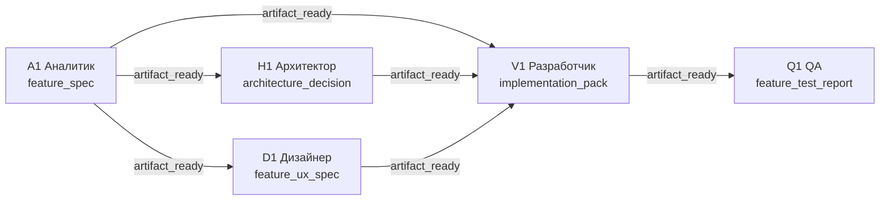

# T03: контракт артефактов и контекста collaboration plan

Статус: дизайн утверждён владельцем 29 сентября 2026 года.  
Область: первый исполняемый шаблон T03 «Продуктовая фича» поверх уже
работающих task dependencies и `TaskContext v1`.

## Цель

Сделать роли внутри одного `collaboration plan` источниками и потребителями
проверяемых версионируемых артефактов. План обязан передавать следующей роли
только результаты указанных predecessors, а не чат карточки или весь граф.

## Не входит

- новый scheduler, замена `task_dependencies` или `DependencyContextEnricher`;
- T04, T05 и другие шаблоны;
- embeddings-подбор, автоперестройка плана или универсальный iOS-renderer;
- несколько независимых выходных артефактов из одного узла.

## Существующая основа

Обычный task DAG уже блокирует дочернюю карточку до policy `review` или
`completed`, а `DependencyContextEnricher` передаёт результаты межкарточных
предшественников перед `claim`. Внутри approved collaboration plan уже есть
nodes, edges, slots и gate-ы `submitted`, `accepted`, `artifact_ready`.

Ограничение текущего контура: node хранит только текст `expected_result`,
edge — только `start_condition`, а slot — свободный `result` и `evidence`.
Поэтому ключ, тип и структура передаваемого результата не проверяются и
следующая роль не получает изолированный slot-to-slot context.

## Решение

### Два независимых слоя артефактов

| Слой | Владелец | Назначение |
| --- | --- | --- |
| `artifact_versions` | задача | действующий межкарточный handoff A/B → C |
| `role_slot_artifact_versions` | slot утверждённого плана | handoff между ролями одной карточки |

Один слой не подменяет другой. `TaskContext v1.dependency_context` продолжает
описывать только зависимости задач. Новый
`TaskContext v1.collaboration_context` описывает только прямые predecessors
текущего plan slot-а.

### Контракт node и edge

Каждый T03 node имеет ровно один `output_artifact`:

```json
{
  "key": "feature_spec",
  "type": "specification",
  "format": "json",
  "required_fields": ["scope", "out_of_scope", "acceptance_criteria", "open_questions"]
}
```

Edge хранит `artifact_key`. Сервер принимает edge только когда его ключ равен
ключу `output_artifact` исходного node. Таким образом edge не может сослаться
на несуществующий или чужой результат.

У одного node только один пакет в T03/1.0. Внутри пакета может быть много
разделов: например, `feature_spec` объединяет scope, правила, acceptance
criteria, NFR и открытые вопросы. В будущем node сможет объявлять массив
`output_artifacts`; это не меняет семантику существующего единственного
пакета.

### Версии slot-артефакта

Новая таблица `role_slot_artifact_versions` хранит неизменяемые попытки сдачи:

```text
id, slot_id, version_no,
artifact_key, artifact_type, artifact_format,
summary, payload_json, evidence_json,
status, created_by, created_at
```

Допустимые статусы: `submitted`, `accepted`, `revision_requested`, `rejected`.
Новая сдача после возврата создаёт следующую `version_no`, не переписывая
прежнюю. Только последняя версия со статусом, достаточным для gate-а, может
открыть successor.

### Сдача и валидация

Роль сдаёт `summary`, структурированный `payload` и `evidence`. Сервер до
записи проверяет:

1. slot находится в `active` и принадлежит вызывающей роли;
2. `artifact_key`, `type` и `format` совпадают с node-контрактом;
3. `payload` содержит все `required_fields` с непустыми значениями;
4. `evidence` соответствует ограничению размера и безопасному существующему
   формату ссылки.

Невалидная сдача не меняет slot, не создаёт artifact version и не будит
successor. Существующий endpoint slot result сохраняет обратную совместимость
для планов без artifact contract; T03 использует расширенную форму сдачи.

### Gate-ы T03

**Обновлено 29.09.2026 (владелец):** участие владельца в T03 — только
`approve` плана (старт). Дальше вся цепочка идёт по `artifact_ready`: смысл
автоматизации теряется, если владелец должен подтверждать каждый внутренний
переход. `accepted` как явное действие владельца сохранился только как
доступный, но не обязательный инструмент — `reject`/`revision-request`
работают в любой момент, просто не являются условием для старта successor-а.



- A1 → H1/D1/V1: `artifact_ready` — submitted `feature_spec` с evidence
  сам открывает включённые узлы, без действия владельца.
- H1/D1 → V1: `artifact_ready` только если node включён в конкретную revision.
- V1 → Q1: `artifact_ready`; валидный `implementation_pack` с evidence
  достаточно, отдельное принятие владельцем не требуется.
- `revision_requested` и `rejected` по-прежнему доступны владельцу в любой
  момент и заменяют последнюю версию артефакта, но не открывают successor и
  не являются условием для его старта — тот уже мог открыться по
  предыдущей `artifact_ready`-версии. Тайм-аут либо лимит итераций создаёт
  наблюдаемую эскалацию владельцу, но не меняет DAG.

### Контекст запуска

Непосредственно перед запуском slot-а сервер строит:

```json
{
  "collaboration_context": {
    "plan_id": "tcp_…",
    "revision": 1,
    "slot_key": "p1_executor",
    "predecessor_artifacts": [
      {
        "slot_key": "p1_analysis",
        "artifact_key": "feature_spec",
        "summary": "…",
        "payload": {},
        "evidence": []
      }
    ]
  }
}
```

В пакет попадают только прямые incoming edges данного slot-а. Полные чаты,
результаты несвязанных slots и транзитивные материалы не добавляются. Если
исходный node отключён условием, его edge и artifact отсутствуют; у successor
не остаётся фиктивного пустого входа.

## T03/1.0: словарь артефактов

| Node | Артефакт | Обязательные поля |
| --- | --- | --- |
| A1 Аналитик | `feature_spec` | `scope`, `out_of_scope`, `acceptance_criteria`, `nfr`, `open_questions` |
| H1 Архитектор | `architecture_decision` | `context`, `options`, `decision`, `consequences`, `rollout_rollback` |
| D1 Дизайнер | `feature_ux_spec` | `screens`, `state_matrix`, `accessibility`, `open_questions` |
| V1 Разработчик | `implementation_pack` | `change_refs`, `build_id`, `test_report`, `deployment_notes`, `known_limitations` |
| Q1 QA | `feature_test_report` | `acceptance_matrix`, `evidence`, `defects`, `recommendation` |

H1 обязателен при кросс-сервисном, контрактном, миграционном или существенном
NFR-изменении. D1 обязателен при новом/существенно изменённом пользовательском
пути. Q1 обязателен для пользовательского, интеграционного или
регрессионно-опасного изменения. Минимальный T03: A1 → V1; исключённые nodes
должны иметь причину в `feature_spec`.

## Наблюдаемость и ошибки

- Логируются: version creation, artifact validation failure, accepted,
  revision requested, rejected, gate opened, gate blocked, escalation.
- В attempt сохраняются `task_context_version`, `plan_id`, revision и id
  фактически использованных artifact versions.
- Селектор не создаёт T03, если задача не проходит признаки применимости; он
  возвращает объяснимый отказ или ручной план.
- Ревизия уже утверждённого плана неизменяема: изменение nodes/edges создаёт
  новый draft и не перестраивает текущий запуск незаметно.

## Проверка

Статус на 29.09.2026: все семь пунктов подтверждены server-тестами (Node 22,
`npm test` 620/620), без real-model и iOS-проверки.

1. A1 → V1 не открывает V1 до accepted `feature_spec`. —
   `task-role-slots.test.ts` («versions structured artifacts…») +
   E2E в `task-collaboration-plans.test.ts` (Task 5).
2. H1/D1 стартуют параллельно, когда включены, и V1 ждёт оба их accepted
   пакета. — E2E Task 5: после accept A1 оба стартуют сами; delivery
   остаётся `waiting`, пока не accepted оба.
3. Отключение H1 или D1 не оставляет висячего edge и не блокирует V1. —
   `task-collaboration-plans.test.ts` («включённые H1/D1/Q1 без висячих
   edges…», второй под-случай «только Q1»).
4. Q1 запускается после валидного `implementation_pack` с evidence, без
   owner acceptance. — E2E Task 5: `qa` становится `active` сразу после
   submit V1, до какого-либо `/artifact/accept` на delivery.
5. Возврат A1 создаёт версию 2, сохраняет версию 1 и не запускает successor.
   — `task-role-slots.test.ts` («uses only the latest artifact version for
   artifact_ready and revision»).
6. Runtime V1 получает только declared A1/H1/D1 artifacts; несвязанный slot
   не попадает в prompt. — `collaborationPlanContext.test.ts` (unrelated slot
   исключён) + `inProcessRun.test.ts` (T03-тест: сериализованный bridge input
   не содержит "unrelated", "token", "password") + E2E Task 5
   (`buildCollaborationPlanContext` возвращает ровно 3 предшественника).
7. Старый ручной slot result и существующие plans без artifact contract не
   меняют поведения. — эндпоинт `/result` не тронут (Task 2 плана), покрыт
   существующими тестами `task-role-slots.test.ts`, которые остались
   зелёными без изменений.

## Последовательность реализации

1. ✅ Миграция `075_collaboration_plan_artifact_contract` и строгие TypeScript
   типы node/edge/artifact version. (`4b848568`)
2. ✅ CRUD/валидация plan contract и обратная совместимость старых plan rows.
   (часть `075`/`076`, `4b848568`/`96a3f13`)
3. ✅ Версионируемая сдача slot artifact, gate evaluation и события аудита.
   (`96a3f13`, миграция `076_role_slot_artifact_versions`)
4. ✅ `collaborationPlanContext.ts` перед `runRoleInProcess` и проброс в
   Python `TaskContext v1` bridge. (`c62e0417`)
5. ✅ T03 proposal/template (`profile: "product_feature"`, миграция
   `077_collaboration_plan_product_feature_profile`) и адресные
   server-тесты, включая изолированный E2E. (`d5d9137`, `53778c2d`)
6. ⏳ Отдельный scope для API iOS и универсального renderer после
   стабилизации нормализованного API — не начат, намеренно вне этого
   server-инкремента.
