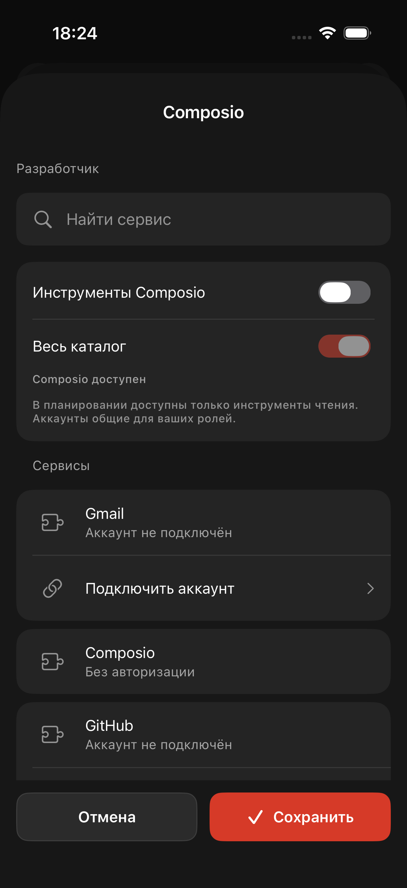
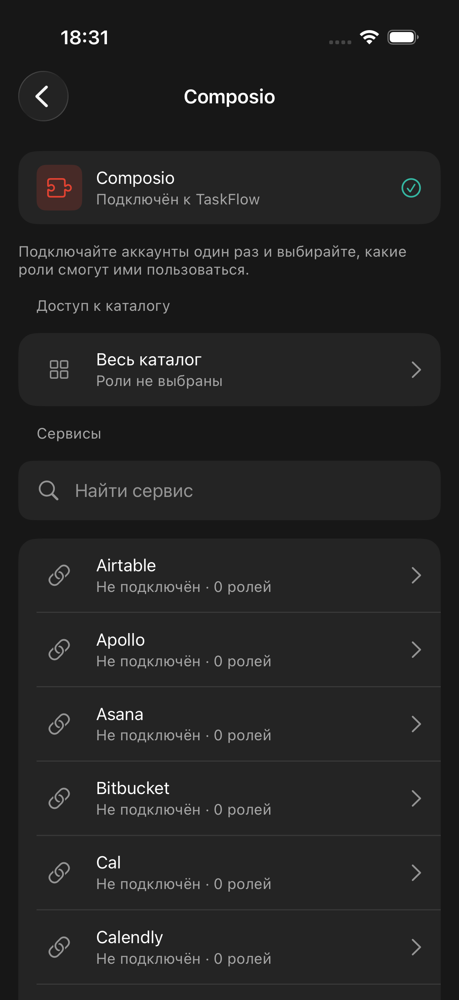
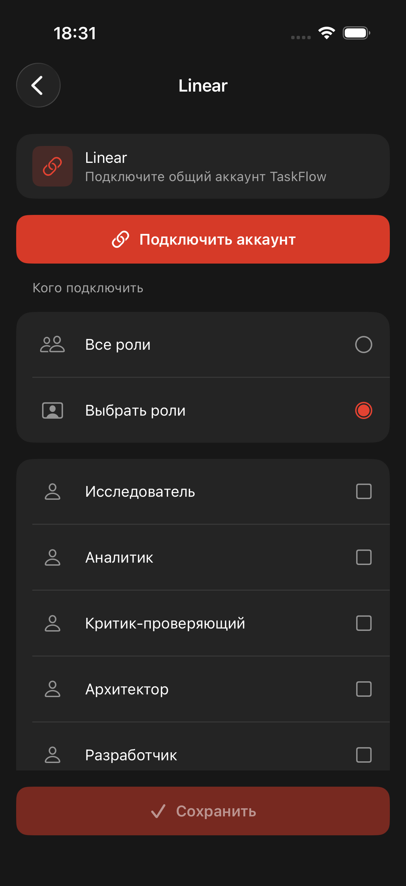
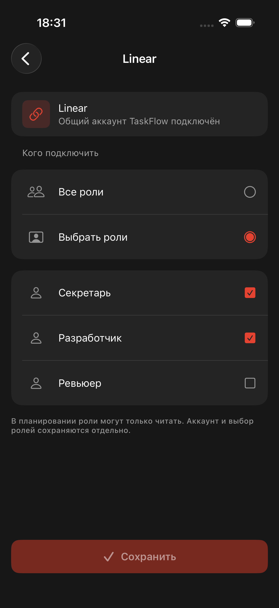

# Общие подключения Composio в TaskFlow — 01.10.2026

Результат: настройки перенесены из отдельной роли в **Настройки → Интеграции → Composio**. Владелец подключает общий аккаунт сервиса и на этом же экране выбирает все текущие роли либо конкретные роли. Доступ не выдаётся при открытии страницы или завершении авторизации: выбор сохраняется отдельной кнопкой.

## Интерфейс

- В общих интеграциях появился раздел «Подключения TaskFlow» с Composio.
- Общий экран показывает состояние подключения TaskFlow к Composio, каталог, поиск, состояние аккаунта и количество ролей для каждого сервиса. Подключённые сервисы показаны первыми.
- Страница сервиса содержит общий аккаунт, кнопку его авторизации при необходимости и выбор «Все роли / Выбрать роли» со списком ролей. После возврата из авторизации статус обновляется.
- «Весь каталог» настраивается отдельно в том же общем разделе. Роли с таким доступом отмечены на страницах отдельных сервисов.
- Из редактора роли удалены кнопка Composio и её шторка. Сохраняются настройки запуска и включения самой роли.
- Используются существующие `TFCard`, `TFListRow`, `TFSectionHeader`, `TFTextField`, `TFButton`, цвета и отступы TaskFlow, системная навигация через `tfNativeHeader`. Собственный набор компонентов не создан.

## Поведение и совместимость

Сервер не менялся. Существующее подключение Composio уже общее: user ID строится из ID владельца. iOS использует существующие owner-only `/api/roles/:role/composio` и `/authorize`, а общий экран собирает политики ролей и сохраняет только изменённые политики. Существующие подключения и разрешения не мигрируются и не сбрасываются при открытии.

Добавление/удаление Linear у включённой роли сохраняет её остальные сервисы. Включение ранее отключённой роли для одного сервиса не активирует её старый список сервисов незаметно. Пустой список не превращается во весь каталог.

Серверное `toolkits=null` означает весь каталог и не поддерживает исключение одного сервиса. Поэтому такую роль нельзя незаметно превратить в список из первых 50 элементов: её доступ изменяется явно через «Весь каталог». Существующая политика планирования (инструменты чтения) остаётся на сервере.

Выбор «Все роли» относится к текущему списку; будущие новые роли автоматически не подключаются. Применение к нескольким ролям использует отдельные существующие PATCH: при частичной ошибке уже успешные изменения учитываются, пользователь видит ошибку, повтор сохраняет оставшиеся. Это не серверная атомарная групповая операция.

Каталог и поиск используют существующий API (начальная выдача ограничена сервером). Чтение политик ограничено тремя параллельными запросами, чтобы не запускать неограниченное число hosted-MCP процессов.

## Проверка

- До изменения: XCUITest воспроизвёл старую шторку Composio внутри роли, 1/1 PASS.
- 7 XCTest: декодирование, различие полного и пустого каталога, сохранение соседних сервисов, запрет скрытого сужения полного каталога, отсутствие скрытой активации старых сервисов, выбор нужных ролей для Linear.
- 3 XCUITest PASS в `/tmp/taskflow-composio-verified.xcresult`: удаление старого входа из роли; выбор всех/двух ролей, сохранение и повторное открытие на тестовых данных; живые общие настройки и поиск Linear без записи.
- В живой проверке Composio доступен, Linear показал неподключённый аккаунт и невыбранные роли. Ни OAuth, ни сохранение разрешений на живом сервере не выполнялись.
- Временный preview-маршрут и временные UI-сценарии с демонстрационными данными после проверки удалены. В постоянном UI-тесте осталась проверка удаления старого входа; fixture модели доступна для unit tests только в Debug и не выбирается пользовательским экраном.
- Итоговая сборка и повторные 7 XCTest + 1 XCUITest PASS после удаления временного маршрута (`/tmp/taskflow-composio-final.xcresult`). `git diff --check` чисто.

## Скриншоты XCUITest

Старый экран внутри роли:

Общий экран, данные живого сервера:

Linear, данные живого сервера — аккаунт ещё не подключён:

Выбор двух ролей, **демонстрационные данные**, без изменения живых разрешений:

## Граница результата

Изменён локальный iOS-проект. Новая сборка на физический телефон не устанавливалась; сервер .110 не деплоился, поскольку API уже поддерживает эту схему. Подключение реального аккаунта Linear и выполнение роли через него остаются пользовательскими действиями, не частью проверки интерфейса.
