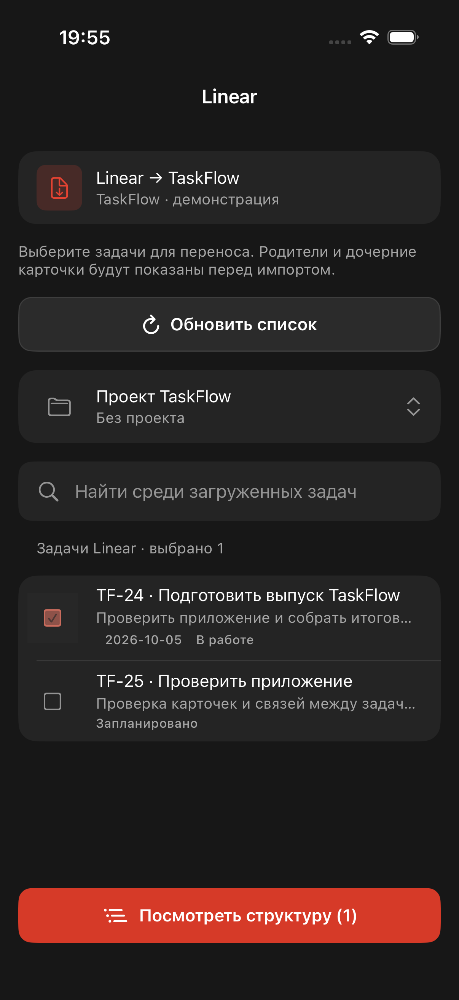
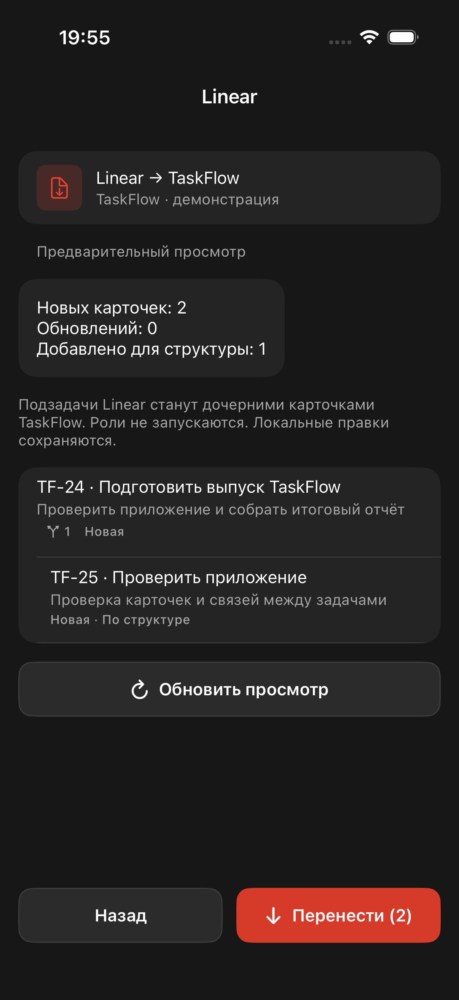
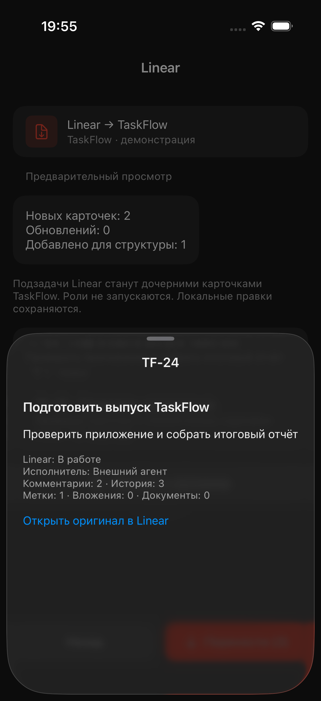
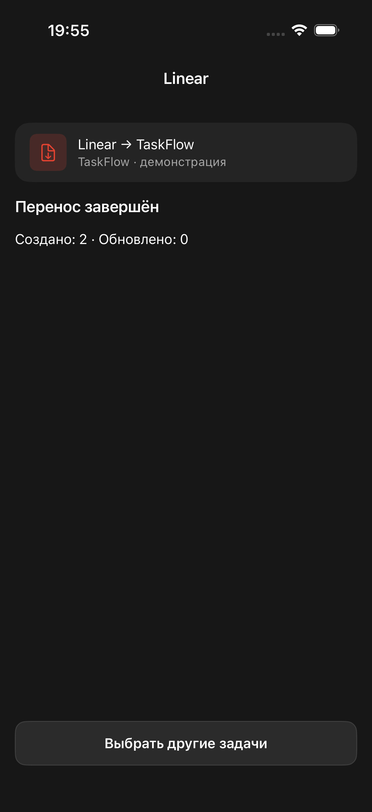

# Linear → TaskFlow: первый этап, 01.10.2026

## Результат

Реализован выборочный односторонний импорт: **Настройки → Интеграции → Linear → Синхронизация → выбор карточек → предварительный просмотр → Перенести**. Экран использует компоненты TaskFlow. Пользователь выбирает внутренний проект назначения или входящие.

Задача Linear становится обычной карточкой TaskFlow. Sub-issue становится дочерней карточкой через существующий parent_id; шаги исполнения не создаются. При выборе родителя загружаются его потомки; при выборе дочерней задачи добавляются необходимые предки, без соседних веток. Полный состав показан перед записью.

Переносятся название, Markdown-описание, приоритет, срок, доступное соответствие статуса, метки, комментарии, документы и история с подписью внешнего автора. Блокировки между уже сопоставленными карточками становятся зависимостями TaskFlow; остальные связи и вложения сохраняются как исходные сведения и ссылки. Файлы вложений не скачиваются. Исходные workspace/issue UUID и снимки хранятся отдельно; терминология и основная модель TaskFlow сохранены.

Импорт не назначает внешних исполнителей внутренним ролям и не запускает агентов. Подключение для чтения использует общий аккаунт Composio владельца, независимо от выдачи инструментов отдельным ролям.

## Повторный перенос и ограничения

Соответствие по workspace + UUID предотвращает дубли. Повтор подтверждения одного просмотра идемпотентен. Обновления сравнивают источник, последнее применённое значение и текущее локальное: локальные правки карточек и комментариев сохраняются. Изменения после просмотра требуют нового просмотра. Запись всей структуры выполняется одной транзакцией; цикл или ошибка откатывают перенос целиком.

Обратной синхронизации и автоматического удаления карточек нет. Сопоставления и применённые значения подготовлены для второго этапа. Отменённый статус Linear сохраняется в исходных сведениях и отмечается предупреждением; внутри TaskFlow карточка остаётся active. Импорт меток сохраняет локальные названия/цвета; новые названия и цвета источника доступны в метаданных. История импортируется как текст с исходными полями, без попытки воспроизвести внутренние действия агента.

Выбор до 50 задач, замкнутая структура до 500 карточек, до 5000 элементов одной коллекции и 20 МБ снимка. Превышение явно прерывает подготовку. Подготовка идёт в фоне до 10 минут; подтверждённый снимок действует 15 минут. Перезапуск сервера прерывает незавершённую загрузку и требует нового просмотра.

## Проверка и состояние

- TypeScript build прошёл; полный набор: 793 теста в 107 файлах PASS (включает текущие чужие изменения role-home в рабочей копии). 28 тематических проверок Linear/Composio; серверные тесты проверяют структуру, пагинацию, авторизацию, отсутствие записей до подтверждения, повторный импорт, конфликты и транзакционный откат.
- iOS: 5 XCTest прошли; временный XCUITest прошёл выбор → просмотр структуры → исходное описание → подтверждение. Итоговая сборка и 5 XCTest повторно прошли после удаления временных маршрутов и демонстрационных данных.
- Кадры ниже сняты XCUITest на демонстрационных данных. Они подтверждают поведение интерфейса, а не реальный импорт из аккаунта Linear.
- Живая read-only проверка Composio: активных подключений Linear у владельцев нет. Реальный источник пока не проверен.
- На .110 не выкладывалось; реальные карточки не импортировались, приложение на телефон не устанавливалось.
- Публикация документа через TaskFlow MCP недоступна: API вернул 401 Invalid token. Артефакт сохранён в репозитории.

## Кадры

## Сервер

Серверный артефакт: /Users/max/Проекты/New-Todoist-server/docs/2026-10-01-linear-import.md. Миграция 085 создаёт отдельные таблицы сопоставлений, исходных объектов, связей и просмотров.

Официальные источники: [GraphQL](https://linear.app/developers/graphql), [пагинация](https://linear.app/developers/pagination), [parent/sub-issues](https://linear.app/docs/parent-and-sub-issues), [Composio Linear](https://docs.composio.dev/toolkits/linear).
