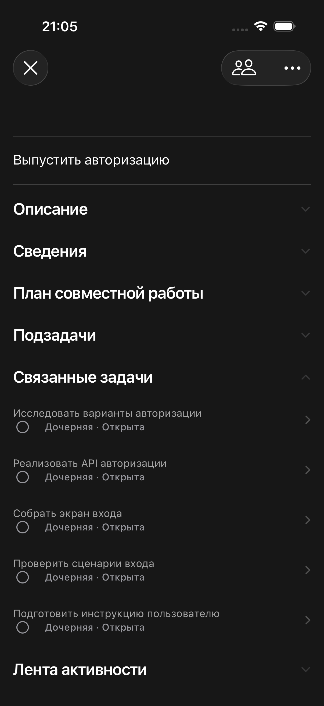
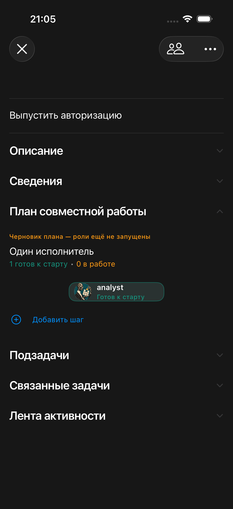
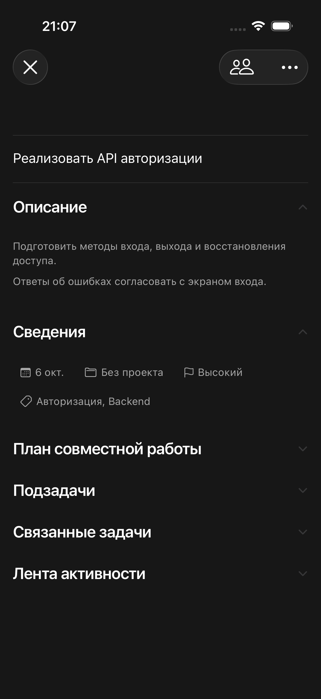
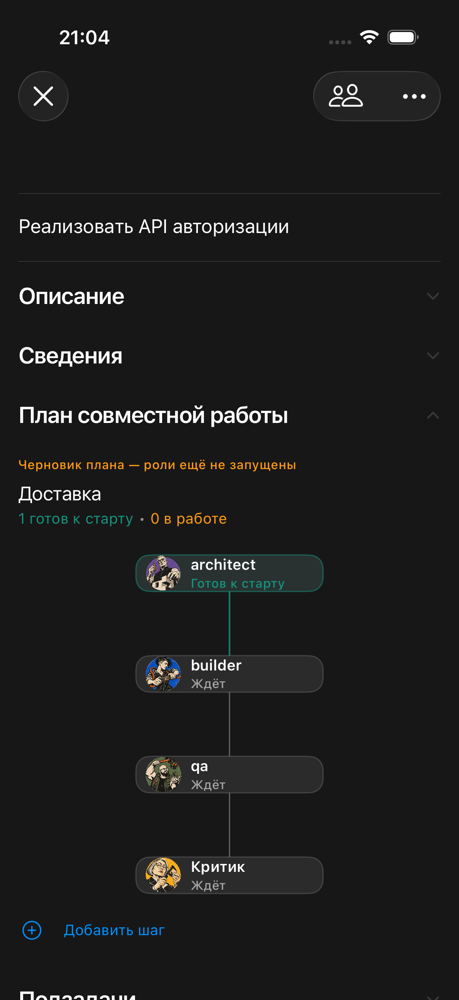
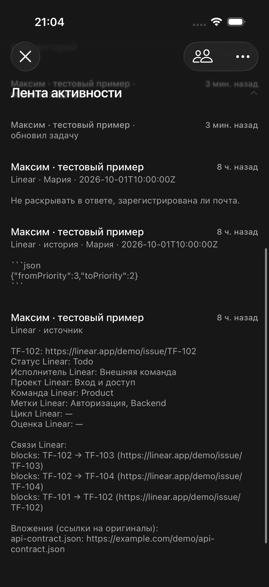

# Настоящие карточки TaskFlow после тестового импорта

01.10.2026. Снимки штатного TaskFormScreen и CollaborationPlanView в iOS Simulator. Интерфейс карточки не менялся. Пример создан реальным createLinearPreview → commitLinearPreview в отдельной локальной SQLite базе; затем обычное приложение получило данные по настоящим API этого тестового сервера.

Источник — вымышленный снимок Linear, а не живой подключённый аккаунт. Данные и авторы придуманы для демонстрации. Это проверка отображения результата импорта, не проверка OAuth/GraphQL Linear.

## Результат

6 импортированных карточек: родитель «Выпустить авторизацию», 5 дочерних. 6 черновиков плана, 0 шагов исполнения, 10 комментариев с исходным авторством/историей/метаданными/документом. Для всех карточек ready_for_pickup=0. Планы не утверждались, роли не запускались.

- Дочерние карточки — штатная секция «Связанные задачи», строки «Дочерняя · Открыта».
- Описание — существующий редактор «Описание».
- Срок, приоритет и импортированные метки — «Сведения». Проект TaskFlow не выбран, поэтому «Без проекта»; исходный проект Linear остаётся в комментарии источника.
- Черновик ролей и действие «Добавить шаг» — штатный «План совместной работы».
- Комментарии, исходная история и ссылки Linear — «Лента активности».

## Родитель и пять дочерних

## Дочерняя карточка

## Что видно без ретуши

В тестовой базе часть названий ролей отображается ключами architect/builder/qa/analyst. Это не копия настроенного живого каталога ролей. В шапке импортированного комментария указан импортирующий владелец, а внешний автор подписан внутри текста. История пока отображается сырыми полями JSON. Надпись «Готов к старту» в графе черновика — вычисленное состояние корневого узла; запуск заблокирован до утверждения, что обозначено оранжевой подписью.

Эти кадры показывают текущее поведение, а не желаемую полировку. Исправления этих деталей в задачу демонстрации не входили.

## Проверка и изоляция

2 XCUITest основных сценария PASS; отдельный сценарий раскрытия сведений PASS. Снимки сняты XCTAttachment(screenshot:). Навигация — по accessibility label, без координатных тапов. Тестовый токен использовал отдельную запись Keychain; обычная запись сессии не заменялась. Временные настройки локального подключения и тесты удалены после сверки, сервер остановлен. Итоговая сборка после очистки PASS. Живые данные и .110 не менялись.

Воспроизводимый источник: [source.json](2026-10-01-linear-real-cards/source.json). Результат импорта: [result.json](2026-10-01-linear-real-cards/result.json). Секреты в этих файлах отсутствуют.
