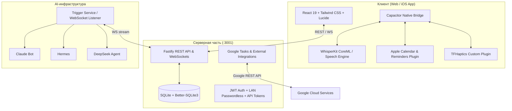

<div align="center">

# ⚡️ TaskFlow (New-Todoist)

📍 **Где что лежит и где единственная копия кода — [INDEX.md](INDEX.md). Читать первым.**

**Личный таск-трекер нового поколения с протоколом работы автономных AI-агентов, нативным распознаванием речи на устройстве и интеграцией с экосистемами Apple и Google.**

[](https://react.dev/)
[](https://www.typescriptlang.org/)
[](https://capacitorjs.com/)
[](https://fastify.dev/)
[](https://sqlite.org/)
[](https://developer.apple.com/ios/)

[Возможности](#-основные-возможности) • [Архитектура](#-архитектура) • [Быстрый старт](#-быстрый-старт) • [iOS и Сборка](#-сборка-и-запуск-на-ios) • [AI Агенты](#-протокол-ai-агентов) • [Интеграции](#-интеграции) • [Документация](#-карта-документации)

</div>

---

## ✨ Основные возможности

### 🎯 Управление задачами и планирование
- **Интуитивный интерфейс:** Премиальная тёмная тема, адаптивная сетка, веерное меню быстрых действий (Fan Menu), жестовое управление (свайпы, перетаскивание dnd-kit).
- **Различные представления:**
  - **«Сегодня» / «Предстоящее»:** Дневная лента, почасовая сетка с поддержкой drag-and-drop распределения по времени (DayHours) и интерактивный свайп-календарь (Week/Month view).
  - **Канбан-доска:** Наглядное отображение статусов задач и подзадач.
  - **Входящие (Inbox), Проекты и Метки:** Иерархическая структура проектов и гибкая система тегов.
- **Подзадачи и чек-листы:** Пошаговое ведение с отображением текущего исполнителя и результата.

### 🧠 AI Ассистент и Second Brain
- **Мультимодельный AI-мозг:** Мгновенное переключение в «Настройках» между локальной моделью (Ollama), Claude Code, Hermes Agent, Antigravity (Gemini) и DeepSeek.
- **Недельная сводка (Second Brain):** Глубокий анализ побед, подсветка зависших хвостов и генерация ключевых приоритетов на неделю в разделе «Обзор».
- **Умная структуризация диктовки:** Преобразование сырого потока мыслей в короткий заголовок действия, очищенное описание, чек-лист подзадач, приоритеты и дедлайны.

### 🎙 Нативное голосовое распознавание (On-Device ASR)
- **WhisperKit CoreML на iPhone:** Полностью локальное распознавание речи прямо на устройстве (Neural Engine) без отправки звука на внешние сервера.
- **Интеллектуальный парсер диктовки:** Автоматическое извлечение дат («завтра в 15:00», «через 3 дня»), приоритетов и проектов из надиктованной фразы.
- **Запасной серверный путь:** Автоматический fallback на Faster-Whisper и локальную LLM (Ollama) в домашней сети.

### 🤖 Протокол AI-агентов (Multi-Agent System)
- **Поддержка множества моделей:** Claude (Opus/Sonnet), Hermes, DeepSeek, Antigravity и другие.
- **Служба-будильник (Trigger Service):** Отслеживает появление задач в реальном времени через WebSockets и автоматически запускает назначенных агентов.
- **Аренда и Heartbeat:** Автоматическое продление аренды, контроль зависших процессов («Сторож тишины») и защита от конфликтов нескольких агентов.
- **Единый протокол сдачи:** Агенты закрывают подзадачи галочками с фиксацией результатов, а финальный приём (`review` ➔ `completed`) остаётся за владельцем.

### 🔄 Интеграции с внешними экосистемами
- **Apple Календарь:** Нативное отображение системных событий календаря прямо в лентах «Сегодня» и «Предстоящее» через `EventKit`.
- **Apple Напоминания:** Двусторонняя синхронизация задач и чек-листов со стандартным приложением «Напоминания» на iOS.
- **Google Задачи (Google Tasks):** Полноценная OAuth 2.0 интеграция со списками задач Google.

---

## 🏛 Архитектура



---

## 📁 Структура проекта

```
TaskFlow/
├── src/                        # Исходный код фронтенда (React 19 + Vite)
│   ├── api/                    # Клиенты REST API и React Query хуки
│   ├── components/             # Компоненты UI (DayHours, TaskBoard, FanMenu, Calendar)
│   ├── lib/                    # Утилиты (appleIntegrations, localAI, dictationParser)
│   ├── screens/                # Экраны (Today, Upcoming, TaskDetail, Integrations, etc.)
│   └── store/                  # Глобальное состояние (Zustand)
├── server/                     # Бэкенд (Node.js + Fastify + SQLite)
│   ├── src/                    # API маршруты, миграции схемы, авторизация, WS
│   │   ├── routes/             # tasks, subtasks, agent-state, integrations, auth
│   │   ├── migrations.ts       # Версионные миграции базы данных
│   │   └── access.ts           # Разграничение прав (владелец vs агенты)
│   ├── scripts/                # Служба trigger.py, mcp_server.py, vault-run
│   └── test/                   # Vitest тесты бэкенда и прав доступа
├── ios/                        # Нативный проект iOS (Capacitor + Xcode)
│   └── App/
│       ├── App/                # Swift плагины (EventKitPlugin, LocalAIPlugin, TFHaptics)
│       └── App.xcodeproj       # Проект Xcode с подключенным WhisperKit SPM
├── docs/
│   ├── current/                # Единственная актуальная документация
│   └── archive/                # Исторические планы, ревью и разборы
├── AGENT-PROTOCOL.md           # Правила и протокол работы AI-агентов
├── AGENT-API.md                # Спецификация API для внешних агентов
├── DESIGN.md                   # Гайдлайны дизайна и системы откликов
├── INTEGRATIONS.md             # Инструкция по Google и Apple интеграциям
└── STATUS.md                   # Актуальное состояние разработки проекта
```

---

## 🚀 Быстрый старт

### Требования
- **Node.js:** `>= 20.x`
- **npm:** `>= 10.x`
- **Xcode:** `>= 16.0` (для сборки под iOS)

### 1. Установка зависимостей
```bash
# Установка зависимостей фронтенда
npm install

# Установка зависимостей сервера
npm --prefix server install
```

### 2. Запуск локального сервера разработки
```bash
# Запуск бэкенда (порт 3001)
npm --prefix server run dev

# В отдельном терминале: запуск фронтенда (порт 5180)
npm run dev
```

Откройте в браузере: `http://localhost:5180` (или `http://192.168.1.110:5180`).

---

## 📱 Сборка и запуск на iOS

Исторический разбор сборки сохранён в
[`docs/archive/2026-09-24-before-canonical/lessons/2026-08-18-ios-build-and-on-device-speech.md`](docs/archive/2026-09-24-before-canonical/lessons/2026-08-18-ios-build-and-on-device-speech.md).

> **Рабочая ветка iOS — `native-app`.** Перед любой правкой или сборкой
> проверьте `git branch --show-current`; правила синхронизации и публикации
> описаны в [канонической документации](docs/current/README.md). `main` не является
> веткой текущей разработки нативного приложения.

### Сборка и деплой на физическое устройство за одну команду:

```bash
# 1. Сборка веб-бандла с явным указанием адреса сервера
VITE_API_URL=http://192.168.1.110:3001 npx vite build && npx cap sync ios

# 2. Сборка Release-версии в Xcode
xcodebuild -project ios/App/App.xcodeproj -scheme App -configuration Release \
  -destination "platform=iOS,id=00008150-001545400144401C" \
  -allowProvisioningUpdates build

# 3. Установка на iPhone
xcrun devicectl device install app --device 00008150-001545400144401C \
  ~/Library/Developer/Xcode/DerivedData/App-*/Build/Products/Release-iphoneos/App.app

# 4. Запуск приложения на разблокированном телефоне
xcrun devicectl device process launch --device 00008150-001545400144401C \
  --terminate-existing com.maksim.taskflow
```

---

## 🤖 Протокол AI-агентов

Агенты взаимодействуют с TaskFlow по строгому протоколу:
1. **Взятие задачи:** `POST /api/tasks/:id/claim` — задача блокируется за агентом на 15 минут.
2. **Шаг в работе:** `POST /api/subtasks/:id/work` (`state="in_progress"`).
3. **Завершение шага:** Закрытие галочкой с обязательным текстовым итогом `result` (1–2 предложения).
4. **Сдача задачи:** Перевод в `state="review"` — окончательно задачу закрывает только владелец.
5. **Сторож тишины (Deadlock Prevention):** При отсутствии активности > 20 минут выдаётся предупреждение; через 45 минут задача автоматически возвращается в `blocked`.

Полная спецификация: [`AGENT-PROTOCOL.md`](AGENT-PROTOCOL.md) и [`AGENT-API.md`](AGENT-API.md).

---

## 🔗 Интеграции

- **Google Tasks:** Подключение через OAuth 2.0, синхронизация списков и статусов.
- **Apple Calendar & Reminders:** Нативный плагин [`EventKitPlugin.swift`](ios/App/App/EventKitPlugin.swift), использующий системный фреймворк iOS `EventKit`.
- Подробное руководство: [`INTEGRATIONS.md`](INTEGRATIONS.md).

---

## 📚 Карта документации

| Документ | Описание |
| :--- | :--- |
| [`docs/current/README.md`](docs/current/README.md) | **Единственная актуальная точка правды:** состояние агентской платформы, сверка с планом Manus и дальнейшие этапы. |
| [`docs/current/taskflow-orchestrator.md`](docs/current/taskflow-orchestrator.md) | **Операционный регламент автономных исполнителей.** |
| [`docs/current/taskflow-task-route-map.html`](docs/current/taskflow-task-route-map.html) | **Живая HTML-карта маршрута задачи.** |
| [`docs/archive/2026-09-24-before-canonical/`](docs/archive/2026-09-24-before-canonical/) | **История:** прежние планы, ревью, handoff, спецификации и инженерные разборы. |
| [`AGENT-PROTOCOL.md`](AGENT-PROTOCOL.md) | **Правила агентов:** жизненный цикл задач, шаги, аренда, сдача работы. |
| [`AGENT-API.md`](AGENT-API.md) | **API для агентов:** спецификация REST-эндпоинтов, токены, MCP. |
| [`INTEGRATIONS.md`](INTEGRATIONS.md) | **Интеграции:** настройка Google Tasks, Apple Calendar и Reminders. |
| [`DESIGN.md`](DESIGN.md) | **Дизайн-система:** палитра, анимации, правила вёрстки, тактильный отклик (Haptics). |
| [`server/scripts/TRIGGER.md`](server/scripts/TRIGGER.md) | **Служба будильника:** WebSocket-слушатель задач и запуск агентов. |

---

## 🧪 Тестирование

```bash
# Тесты фронтенда (парсинг диктовки, компоненты)
npm test

# Тесты сервера (права доступа, агенты, интеграции, e2e)
npm --prefix server test

# Проверка UI и контролов интерфейса
npm run check
```

---

<div align="center">
Разработано с заботой о скорости, приватности и автономности.
</div>
