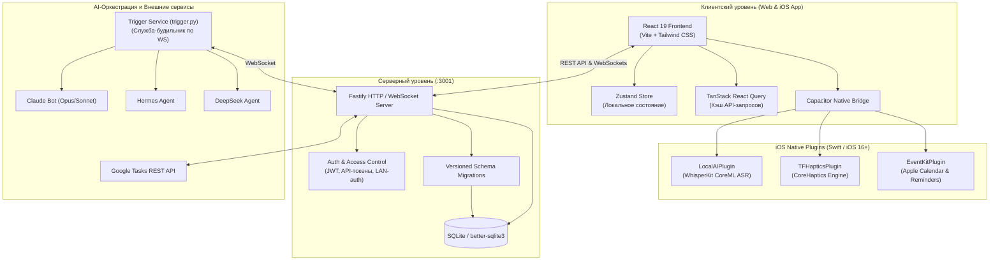

# Архитектура TaskFlow

В этом документе описана полная архитектура системы TaskFlow: взаимодействие компонентов, потоки данных, система безопасности, нативные iOS-модули и протокол работы автономных AI-агентов.

---

## 1. Общая схема системы

---

## 2. Клиентский уровень (Frontend)

### Технологический стек
- **React 19 + TypeScript + Vite 8**
- **Стилизация:** Tailwind CSS 4 + кастомный дизайн-токен `index.css` (тёмная и светлая палитры, адаптивные отступы под Dynamic Island / Safe Area).
- **Управление состоянием:**
  - `zustand`: глобальные пользовательские настройки, тема, выбранные фильтры.
  - `@tanstack/react-query`: кэширование, дедупликация и инвалидация сетевых запросов.
- **Жесты и анимации:**
  - `@dnd-kit/core` и `@dnd-kit/sortable`: плавное перетаскивание задач между днями и временными слотами в DayHours.
  - Сенсорные оптимизации с виброоткликом (CoreHaptics) на физическом устройстве.

### Ключевые экраны
- **Сегодня (`TodayScreen.tsx`):** почасовая сетка с перетаскиванием задач, список ожидания проверки агентов («Ждут вас»), события Apple Календаря.
- **Предстоящее (`UpcomingScreen.tsx`):** трёхрежимный календарный интерфейс:
  - Свайп-лента дней с компактным календарем.
  - Понедельная и помесячная сетки (`WeekGrid`, `MonthGrid`).
  - Почасовое расписание на выбранные даты (`DayHours`).
- **Интеграции (`IntegrationsScreen.tsx`):** центр управления внешними сервисами (Google Tasks, Apple Calendar, Apple Reminders).
- **Модели распознавания (`VoiceModelsScreen.tsx`):** выбор и загрузка CoreML-моделей WhisperKit на устройство.

---

## 3. Нативные iOS-модули (Capacitor Swift Plugins)

Все плагины встроены непосредственно в таргет Xcode `App` и регистрируются в `LocalAIBridgeViewController.capacitorDidLoad()`:

1. **`LocalAIPlugin.swift` (On-Device ASR):**
   - Интеграция с [WhisperKit](https://github.com/argmaxinc/WhisperKit).
   - Модели `openai_whisper-small_216MB` и `turbo_632MB` исполняются локально на Apple Neural Engine (ANE).
   - Поддержка запасного системного распознавателя `DictationTranscriber` (Speech.framework, iOS 26+).

2. **`TFHapticsPlugin.swift` (Виброотклик):**
   - Управление тактильным движком через `CoreHaptics` с настройкой `intensity` и `sharpness`.
   - Заранее прогретый экземпляр `CHHapticEngine`, устраняющий задержки срабатывания.

3. **`EventKitPlugin.swift` (Календарь и Напоминания):**
   - Доступ к системному хранилищу `EKEventStore`.
   - Чтение и создание событий календаря, синхронизация списков и задач в Apple Напоминаниях.

---

## 4. Серверная архитектура (Backend)

- **Движок:** Node.js + Fastify (высокопроизводительный асинхронный сервер).
- **База данных:** SQLite (`better-sqlite3`), локальный файл с WAL-журналированием.
- **Миграции схемы (`server/src/migrations.ts`):** версионная система миграций (таблица `schema_migrations`), гарантирующая целостность структуры БД при обновлениях.

### Разграничение прав доступа (`server/src/access.ts`)
- **Владелец (`role='owner'`):** полный доступ к просмотру, созданию, редактированию и удалению всех задач, проектов, меток и комментариев.
- **AI-агенты (`type='ai'`):**
  - Видят свои назначенные задачи и задачи проектов владельца.
  - Создаваемые агентами метки и проекты автоматически привязываются к владельцу (`ownerForNewShared`).
  - Агент может переводить задачу только в статус `review`, закрыть задачу (`completed`) имеет право только владелец.
  - Попытка взять чужую задачу возвращает понятный отказ `403 Forbidden` с указанием текущего исполнителя.

### Авторизация
- **JWT-токены:** для сессий веб-приложения и мобильного клиента.
- **LAN Passwordless (Вход без пароля):** автоматический безопасный вход владельца из доверенной локальной домашней сети при запросах из браузера (`TASKFLOW_LAN_NO_AUTH=1`).
- **Постоянные API-токены:** хэшированные отпечатки ключей в БД (`users.api_token`) для внешних агентов и служб.

---

## 5. Протокол AI-оркестрации

1. **Служба-будильник (`server/scripts/trigger.py`):**
   - Поддерживает постоянное WebSocket-соединение с сервером от имени каждого зарегистрированного агента.
   - При назначении задачи на агента служба автоматически захватывает задачу (`claim`) и запускает соответствующий процесс (Claude `-p`, Hermes `-z`, DeepSeek headless).
2. **Аренда и Сторож тишины:**
   - Аренда задачи длится 15 минут и автоматически продлевается при каждом шаге агента или пинге службы (`/heartbeat`).
   - Если агент не совершает действий > 20 минут, в карточку задачи пишется предупреждение; через 45 минут задача переводится в `blocked` с завершением зависшего процесса.
3. **Фиксация результатов:**
   - Шаги закрываются по одному с обязательным полем `result`.
   - После выполнения всех пунктов агент отправляет финальный отчёт и статус `review`.
